# Vintage Story Farming Dashboard

A planner for a Vintage Story playthrough. Tracks crops, soil, climate, fertilizers, animals, bees, fruit trees, berries, mushroom troughs, greenhouses, foraging routes, and the math behind all of it. Every number is traced to a specific spot in the survival mod source or the engine binary, so the recommendations match the game rather than the wiki.

A companion `farming_dashboard.xlsx` carries the same data model in a Google-Sheets-compatible workbook for offline planning and group collaboration.

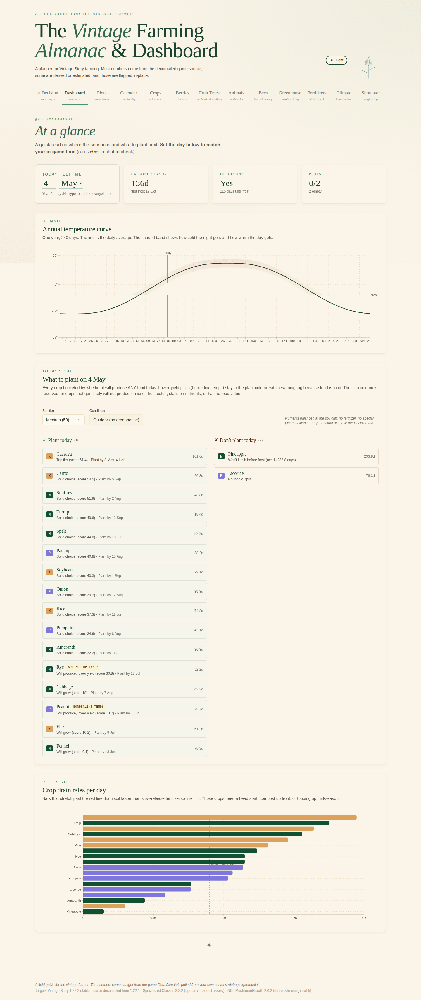

The dashboard reads from your server's actual `/debug exptempplot` climate, your current soil tier, your enabled mod set, and gives one straight answer to "what should I plant right now". Plus the full reasoning underneath if you want to look at the math.

---

## What it actually does

The app is twenty-one tabs that share one data model. Each tab is a different question you might be asking.

### "What should I plant today?"

The Decision tab ranks every crop against your current conditions. The score combines productivity (satiety per real day), frost safety, rotation fit, follow-up potential, growth speed bonus, and food-category weights. Weights are tunable from the score-tuning section, and the rationale for each ranking is shown inline.

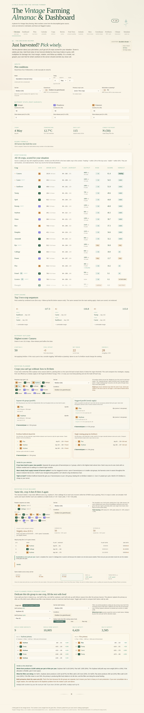

Below the rank, there's a top-3 chain analyzer that picks the best follow-up crop for each leader (drained-axis aware), and the "what won't produce food today" list calls out crops that are out of season, will starve for nutrients, or will run into frost mid-grow.

### "Will this crop survive if I plant it on day X?"

The Calendar tab is a crop × day-of-year matrix. Each cell is colored by what the leaky-bucket cold/heat simulation says about planting that day on the selected soil tier: green if the crop will finish cleanly, amber if it'll grow with reduced yield, red if it'll die, pale if it can't finish before autumn freeze, dark if nutrients stall it indefinitely.

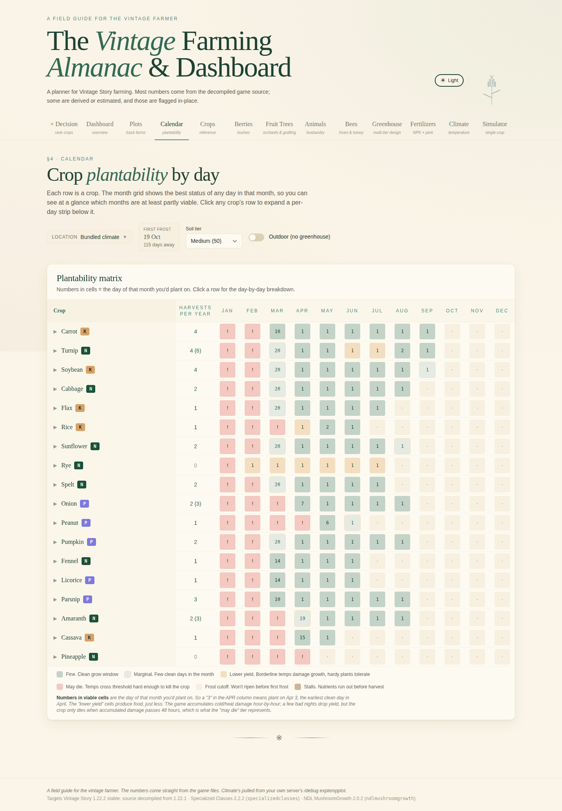

Click any row to expand the per-day strip below it.

### "When are the freeze dates and how warm does it actually get?"

The Climate tab plots one year of daily averages with the diurnal min/max band. The growing-season window is highlighted, and you can overlay any crop's damage thresholds to see exactly where the safe plant-and-harvest window sits.

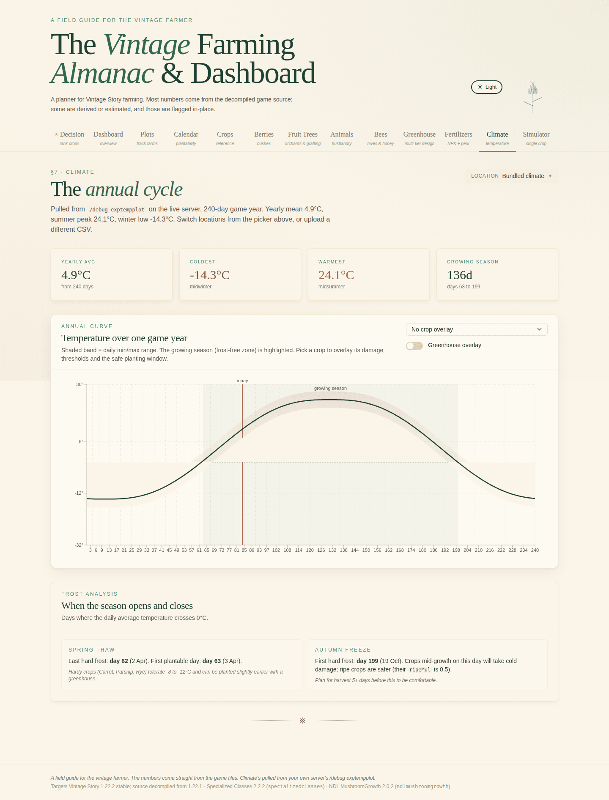

Bring your own CSV by uploading a `/debug exptempplot` export through the Settings tab. The app rebuilds every downstream calculation against your real climate.

### "How fast does each crop drain its axis, and what soil does it want?"

The Crops tab is the canonical reference table: nutrient axis, base consumption, growth-days at your server's `daysPerMonth`, cold/heat thresholds, yield, satiety per use (raw / processed / in-meal / as bread), with the right defaults filled in from the cropProperties JSON.

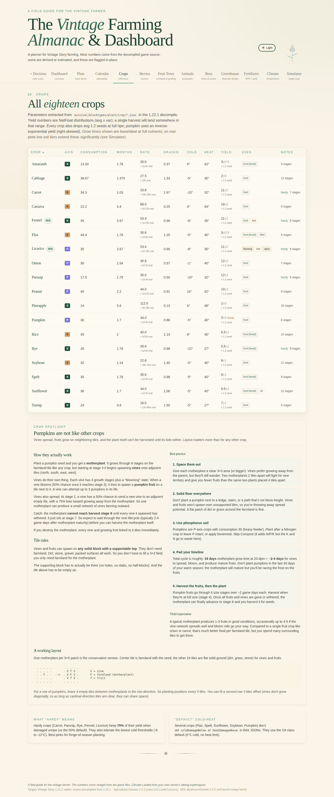

Sort by any column. The food category and nutrient axis show as colored pills so you can scan the table for a balanced rotation at a glance.

### "How am I doing with my actual plots?"

The Plots tab tracks plantings (a planting is a crop + plant day + soil tier + tile count). It calculates the harvest day, expected yield with damage adjustments, and the recommended follow-up crop. The Soil Regen Simulator at the bottom plays out the nutrient curve for a chosen starting state, showing exactly when each axis hits the cap and where cold pauses and slow recovery bands fall.

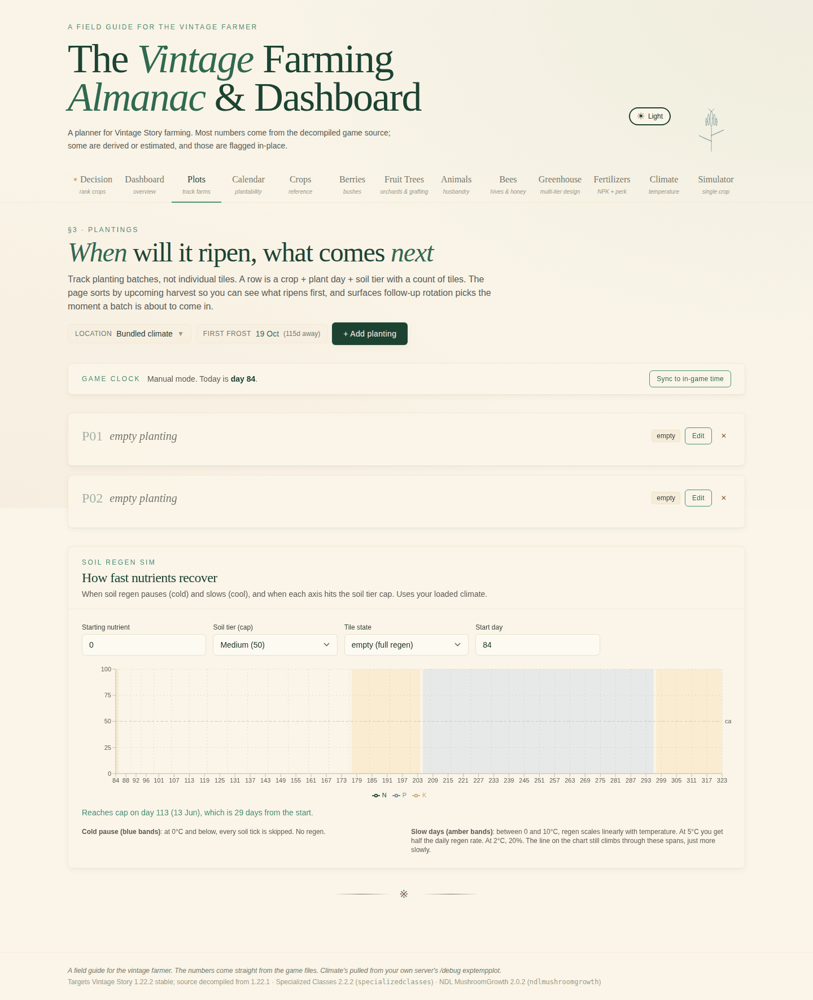

### "What does this one crop actually do over its grow cycle?"

The Simulator tab walks a single crop stage by stage. Each row is one growth stage, with the day it advances, the running temperature, the per-stage growth chance and nutrient factor, and the effective days for that stage given climate and soil constraints. Useful for understanding why a stall happens or why a borderline planting is or isn't worth the risk.

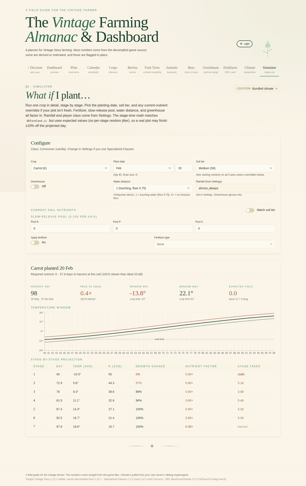

### Greenhouses, the math edition

For a serious indoor build, the Greenhouse tab works through a 14×14×14 multi-tier vertical farm holding 1071 farmland blocks across 7 tiers. Air shafts on a hex pattern carry sky light down through transparent columns at full intensity; water columns on a stride-3 grid hydrate every tier at once. The whole thing is verified cell by cell, with the per-cell light distance map and a histogram showing every farmland tile lands at sunlight 19 or higher (full growth speed).

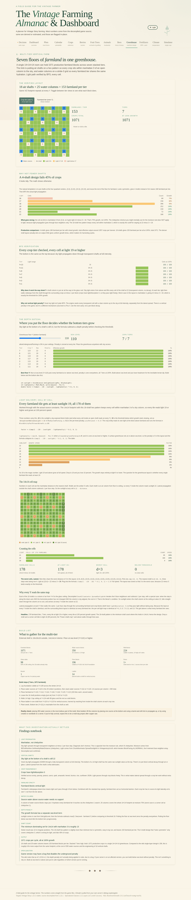

This is also where the BFS-vs-source-trace pedagogy lives: how the engine's `ChunkIlluminator` propagates light, why a sky-aligned shaft's down-axis step costs 0, and where the seemingly-tempting 5-tier or 4-shaft variants break down (the room registry's 14-cell axis cap and the corner cells that fall below the threshold).

### Fertilizers and the perk math

Four amendments (compost, saltpeter, bonemeal, potash), each with a slow-release NPK profile and a permanent-base contribution. The Fertilizers tab shows what each application contributes to the slow-release pool and how the Farmhand class's `fertilizerPermanencePercentage` perk converts a fraction of each application into permanent base fertility.

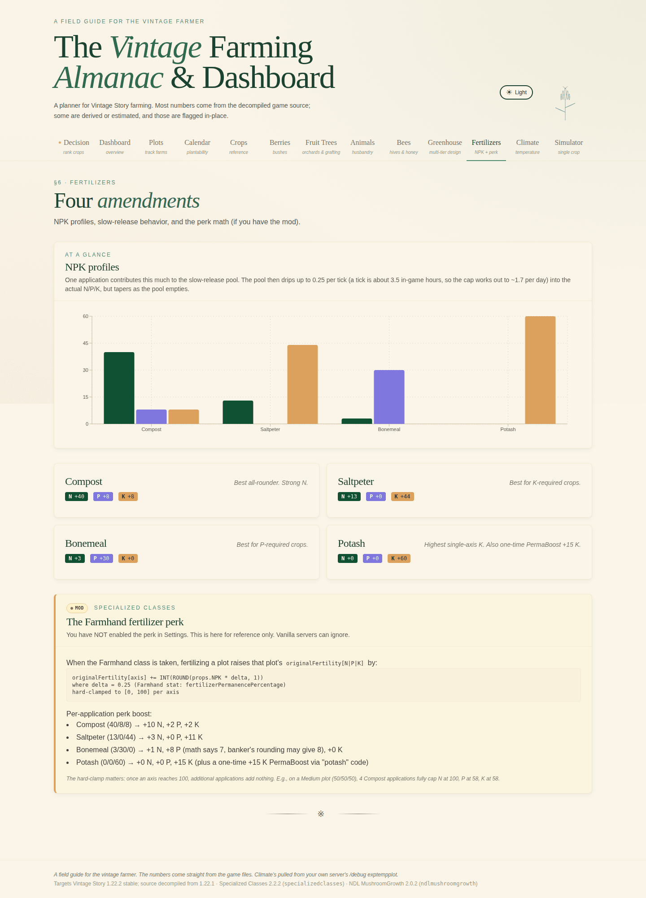

If you have Specialized Classes installed and play Farmhand, the soil-tier-upgrade comparison appears: how much compost + bonemeal + powder-charcoal you need to craft up to the next tier vs. how much you'd need to fertilize the existing tile to the same NPK level. The math goes both directions so you can see which path is cheaper in your inventory.

### Bees, animals, berries, fruit trees

Each has its own tab with the math that matters for that thing.

| | |
|---|---|
| 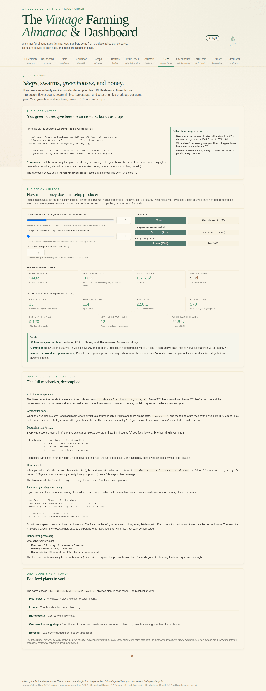 | 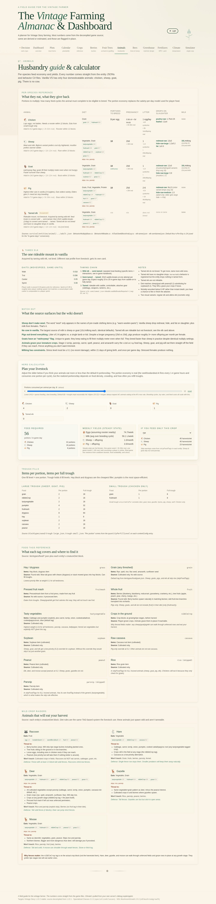 |
| Skep production rates, scan radius, queen-temperature gates, and time-to-fill-honeycomb math. | Chicken/sheep/cow/goat/pig productivity, gestation timing, feed economy, and what each animal returns per real hour. |
| 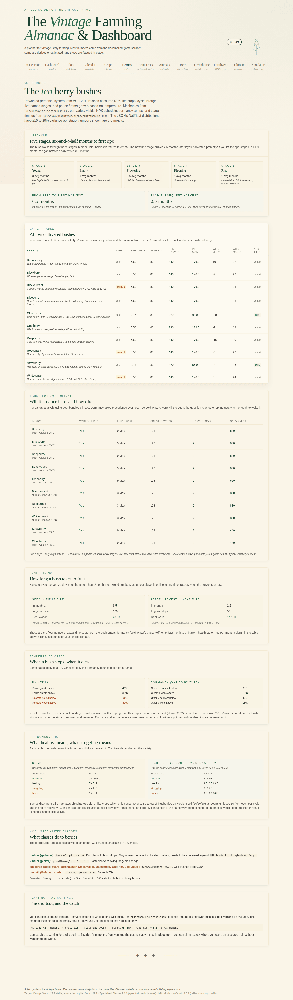 | 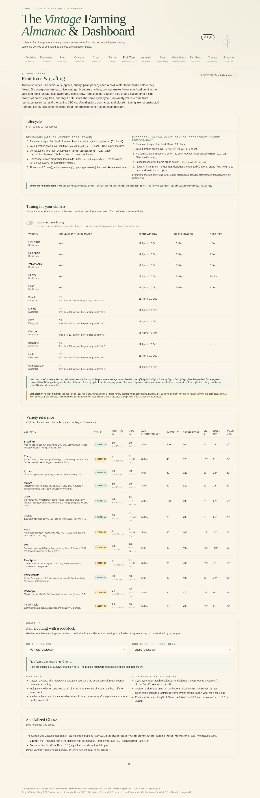 |
| Cultivated bush yields by climate band and soil tier. | Climate windows, fruit yield, ripening schedule. |

### Mushroom troughs (NDL Mushroom Growth mod)

If you've got the NDL Mushroom Growth mod, troughs are a climate-independent food source. No NPK, no light, no temperature gates. The Mushrooms tab works through the soil-tier-sets-grow-time relationship straight from the decompiled `sporetroughBE.cctor` (Low 15d, Medium 13d, High 8d, Terra Preta 5d), plus throughput math, the full 45-species catalog with toxicity tags, and the simplified post-2.0.2 recipe (4 planks + 1 nails).

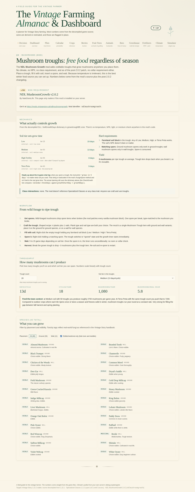

### Reference, settings, and time

Static reference tables, server config (days-per-month, world climate, harsh-winters flag, growth-rate multipliers), location picker, climate upload, beta-feature toggles, and a real-time to game-time converter for figuring out how long real-world hours of presence convert to game days at your server's `daysPerMonth` and clock speed.

| | | |
|---|---|---|
| 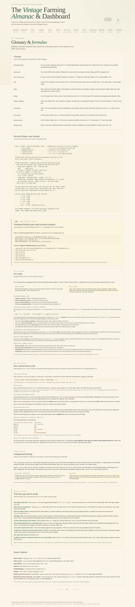 | 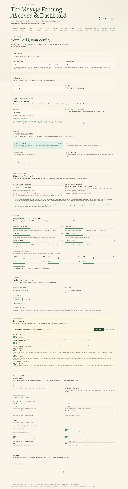 | 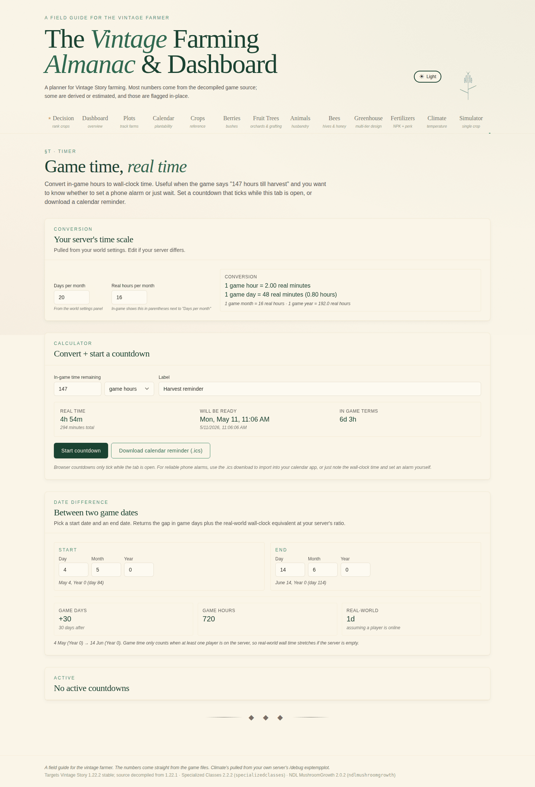 |
| Conversions and lookups. | Your server config. | Real-time to game-time. |

### Beta tabs

Opt in from Settings → Beta features. These exist behind a flag because either the data isn't fully source-traced yet, the mod they target is mod-fragile, or they're heavier on guess-and-check than the rest of the app.

| | |
|---|---|
| 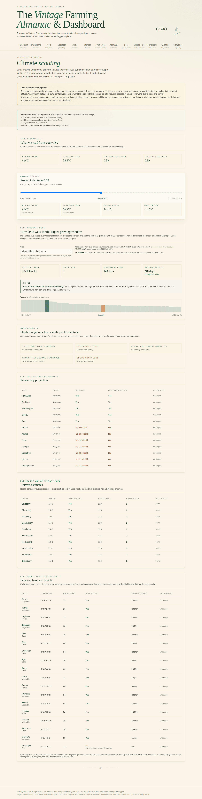 |  |
| Where to look for what biome features. | Pre-server climate projection. |
| 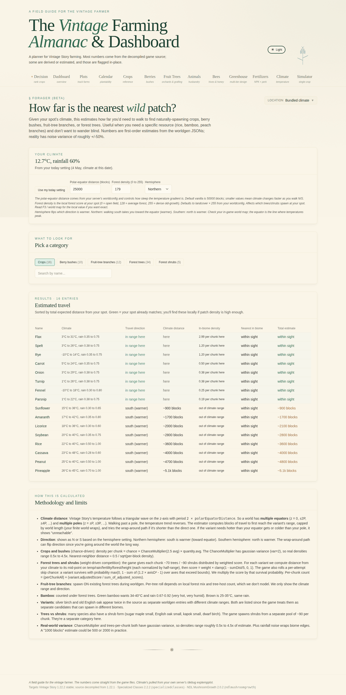 | 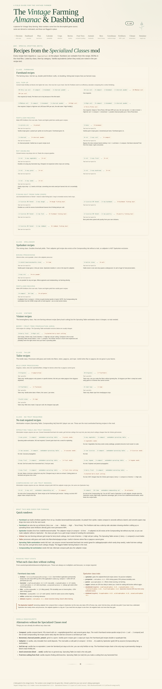 |
| Wild plant routes and mushroom spawns. | Specialized Classes mod recipe paths, per-class. |

---

## Open the app

GitHub Pages serves this repo at the URL in your repo's Pages settings. The entry point is `index.html`. Open it directly, hit the Pages URL in a browser, or run a local static server:

```
python3 -m http.server 8080      # then open http://localhost:8080
npx serve .                       # alternative
```

The `index.html` has the bundled climate inlined into the JS, so opening the file directly from disk (`file://`) also works without a server. The hosted version exposes `climate.csv` next to the HTML so anyone curious about the raw temperature data can grab it.

---

## What's in this repo

```
.
├── index.html                 entry point, ~1 KB Vite shell
├── assets/                    bundled JS (~360 KB gzip) and CSS (~10 KB gzip)
├── climate.csv                240-day climate, daily avg/min/max
├── farming_dashboard.xlsx     spreadsheet equivalent (13 tabs, 2300+ formulas)
├── screenshots/               21 PNGs, one per tab, plus a captures README
├── source/                    full source tree for transparency
│   ├── src/                   React app
│   ├── public/                static assets
│   ├── scripts/capture.mjs    puppeteer screenshot script
│   ├── reference/             decompiled C# files this app's math was traced from
│   ├── package.json
│   └── vite.config.js
├── .nojekyll                  tells GitHub Pages not to Jekyll-process anything
└── README.md                  this file
```

---

## Source verification

Every game-side number in the app is traced to a specific line. The traced files live in `source/reference/`. Highlights:

| Mechanic | Source |
|---|---|
| Crop growth-rate vs nutrient | `BESoilNutrition.GetGrowthRate` (strict-greater thresholds, n > 50 = 1.0x, not n >= 50) |
| Per-stage random duration | `BEFarmland` line 192: `stageHours *= (float)(0.9 + 0.2 * rand.NextDouble())` |
| Cold/heat damage accumulator | `BEFarmland.updateCropDamage` lines 108-160 (leaky bucket, death at 48h accumulated) |
| Per-stage drain | `BEFarmland.ConsumeNutrients` line 270 |
| Growth chance vs temperature | `BlockEntityFastForwardGrowth.cs` line 88 (`growthChance = 1 + (T - 10) * 0.1`, clamped) |
| Light vs growth speed | `BlockEntityFastForwardGrowth.cs` line 89 (`clamp(1 - (19 - (sunlight - penalty)) * 0.1, 0, 1)`) |
| `DelayGrowthBelowSunLight = 19` | `ModSystemFarming.cs` |
| `LossPerLevel = 0.1f` | `ModSystemFarming.cs` |
| Light propagation (6-face manhattan) | `ChunkIlluminator.SpreadSunlightAt` (decompiled from `VintagestoryLib.dll`) |
| Sky-aligned column down-step costs 0 | Same source, special-case in the IL |
| Moisture range formula | `BESoilNutrition.GetGrowthRate` moistFactor (continuous power, not stepped) |
| Soil nutrient regen rate | `BESoilNutrition.UpdateFertility`, per-tick regen scaled by growthChance |
| Greenhouse +5°C bonus | `BlockEntityFastForwardGrowth` (decompiled) |
| Room volume cap | `RoomRegistry.cs` `MAXROOMSIZE = 14` |
| Farmland retention | `BlockFarmland.GetRetention` (top face: 0, others: 3) |
| Bonemeal NPK | `BlockMeal.cs` (3N / 30P / 0K, not the wiki's 0N/20P/0K) |
| Mushroom grow times | NDL Mushroom Growth mod v2.0.2 `sporetroughBE.cctor` + post-2.0.2 changelog |
| Specialized Classes perks | SC mod DLL (decompiled, per-class) |

Wiki claims that haven't been re-traced against source yet are flagged inline on the relevant page rather than presented as ground truth.

---

## Spreadsheet

`farming_dashboard.xlsx` is the same data model in a Google-Sheets-compatible workbook. 13 tabs (Readme, Settings, Players, Crops, Fertilizers, Plot Templates, Calendar, Plots, Inventory, Rotation, Yield Estimator, Overview, Activity Log). 2,300+ formulas, 10 charts, named ranges throughout.

Useful for offline planning, for sharing a planning state across a group on Google Drive, or if you want to drive the math from a familiar spreadsheet UI rather than a webapp.

---

## Building from source

```
cd source
npm install
npm run dev               # dev server on http://localhost:5173
npm run build             # production build into source/dist
```

For a single-file build that opens directly from disk:

```
npx vite build --config vite.config.singlefile.js
# produces source/dist-single/index.html as a standalone artifact
```

To deploy a fresh build to this repo's root, replace `index.html`, `assets/`, and `climate.csv` with the new build output.

---

## Replacing the bundled climate

The runtime tries `fetch('./climate.csv')` first, then falls back to a build-time copy embedded in the JS bundle. To use your own server's climate:

1. Run `/debug exptempplot` in-game, save the output CSV.
2. Drop it at `public/climate.csv` (replacing the existing one), keeping the daily `day,avg,min,max` format.
3. Re-run `npm run build`. Both the runtime fetch and the embedded fallback now match your server.

Alternatively, upload a CSV through the app's Settings tab. That stores it in `localStorage` and overrides both the fetched and embedded climates for your browser only.

---

## Regenerating screenshots

The capture script at `source/scripts/capture.mjs` runs puppeteer against a local copy of the build and saves PNGs into `screenshots/`. From a fresh checkout:

```
cd source
npm install
npx vite build
node scripts/capture.mjs                # walks all 21 tabs at 1440x900 viewport
cd ../screenshots
for f in *.png; do pngquant --quality=70-90 --force --output "$f" "$f"; done
```

The script's `CHROME` constant points at the playwright-cached chromium location used for the bundled captures. Edit it to any Chrome or Chromium binary on your machine. The script seeds `localStorage` to enable beta tabs before navigation, so all 21 captures are unique.

---

## Known limitations

- The plantability calendar and decision scoring assume a typical surface plot (sea level or above, sky-exposed). Underground/cellar adjustments use whatever the game source applies, but exotic placements may still need a per-tile override.
- Specialized Classes mod stats are baked in from v2.2.2. Other versions may differ.
- Mushroom grow times for the post-2.0.2 mod patch are from changelog text, not yet re-traced against the new mod DLL. The pre-2.0.2 numbers are decompile-verified.
- Score weights and category boosts on the Decision tab are planning heuristics, not game rules. They reflect a reasonable default playstyle but aren't a simulation.
- The fruit-tree, berry, and animal tabs assume vanilla mechanics. If you're running mods that change yield rates or growth conditions (e.g. Wild Farming for berries), the per-row numbers won't reflect that.

---

## License

The app, spreadsheet, and source layout in this repo are personal-use material for a Vintage Story playthrough. The decompiled C# files in `source/reference/` and the embedded mod data are property of their respective authors (Anego Studios for vanilla, NDL for the mushroom mod, etc.). Inspect, modify, and share freely for non-commercial use.
