# Vintage Story Farming Dashboard

A planner for Vintage Story farming. The Decision Helper ranks all 18 crops for your specific plot. The Calendar shows what fits before frost. Plot tracker, fertilizer math, climate curve from your own server. Built for VS 1.22.1 with optional Specialized Classes 2.2.2 support.

> **Try it now:** [LIVE-URL] (replace with your GitHub Pages URL once deployed)
>
> **Or download the spreadsheet:** [`farming_dashboard.xlsx`](./farming_dashboard.xlsx) (works in Excel, LibreOffice, or Google Sheets)


*The Decision Helper lands first: enter your plot's conditions, and all 18 crops are scored and ranked for that exact situation. Everything updates live as you type.*

## What's in this repo

| Folder/file | What it is | When to use |
|---|---|---|
| `index.html`, `assets/`, `climate.csv` | Production webapp build | This is what GitHub Pages serves to visitors. You don't edit these directly. |
| `webapp-source/` | React + Vite source for the webapp | Edit this if you want to modify the app. Run `npm install && npm run dev` for a local dev server. |
| `farming_dashboard.xlsx` | Spreadsheet version of the same tool | Use this offline, or if you prefer working in Excel / LibreOffice / Google Sheets. 14 tabs, 3490 formulas, 0 errors. |
| `README.md` | This document | The user-facing intro plus a complete mechanics reference (1900+ lines covering every formula, with file:line citations to the game source). |

The webapp and the spreadsheet are independent: pick whichever fits your workflow. They use the same underlying numbers and the same scoring formula, so their recommendations agree.

## Verified versions

| What | Version | Identifier |
| ---- | ------- | ---------- |
| Vintage Story | **1.22.1 stable** (released 29 April 2026) | base game |
| Specialized Classes mod | **2.2.2** | `specializedclasses` |

If you're on a different game version, the mechanics may have shifted. Recent drift has mostly been crop balance numbers (consumption, grow time) and the underground-farming bug status (still present in 1.22.1, see §15). Check https://www.vintagestory.at/blog.html if you're not sure.

## Quick start (webapp)

1. Open the live URL on any device with a browser.
2. The site lands on the Decision Helper. Set the day to today's in-game date (use `/time` in chat to check).
3. Set your plot's soil tier and current N/P/K levels (read from F3/blockinfo on the farmland block).
4. The crop ranking updates live. Top picks are highlighted; risky picks show why (frost, cold damage, nutrient drain, rotation conflict).

Optional:
- **Plots tab**: track each of your real farms. The dashboard auto-updates as crops mature.
- **Settings tab**: replace the bundled climate with your own server's `/debug exptempplot` CSV. Uploaded data stays in your browser, never sent anywhere.
- **Theme toggle** (sun/moon icon, top right): switch between light parchment and dark forest themes.

## Quick start (spreadsheet)

1. Open `farming_dashboard.xlsx` in Excel, LibreOffice, or upload to Google Sheets.
2. Go to the **Decision** tab.
3. Set inputs in section 1 (mode, today, soil tier, greenhouse, perk, fertilizer plan, current N/P/K, slow-release pool).
4. Read sections 3 to 6: ranked crop list, top crop chains, warnings, projected nutrient outlook.

## Mods this dashboard supports

The dashboard supports **one optional mod**: [Specialized Classes](https://mods.vintagestory.at/specializedclasses) (mod identifier `specializedclasses`, file `SpecializedClasses.dll` v2.2.2, built for VS 1.22.x). The Farmhand class adds a `fertilizer` trait that boosts the per-application effect of fertilizers on `originalFertility`.

**On vanilla servers:** set `Has Farmhand fertilizer perk?` to `FALSE` in Settings and ignore anything labeled `[MOD]`. Everything else (climate model, all 18 crops, fertilizer NPK math, slow-release pool behavior) is pure vanilla.

**With the mod:** set the perk flag to `TRUE` and the Decision Helper will factor the perk into its scoring. The full perk math (decompiled from IL) is in §9 below.

---

## A tour of the webapp

Ten pages, each a different angle on the same farming model.

### Decision · rank crops for your plot

The landing page. Set your plot conditions, see all 18 crops scored and sorted. The scoring breakdown (yield, nutrients, frost safety, damage risk, rotation, follow-up) is documented in §4 and shown as a hover tooltip on each row.

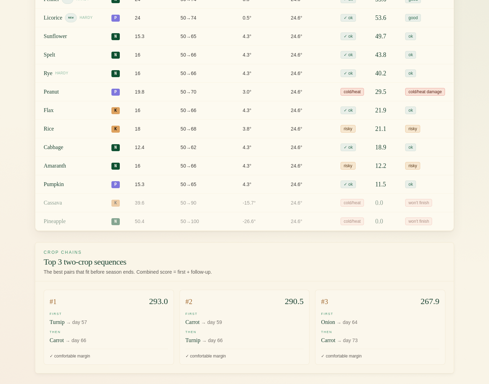

The top section shows the inputs and live KPIs (today's temperature, days left, your lowest nutrient axis). Below the rankings, the "Crop chains" section finds the best two-crop sequences that fit before frost.

### Dashboard · at-a-glance overview

Where the season is, what to plant next, current plot status. **The "Today" tile is editable**: type your in-game day and every other page updates instantly.


Climate curve shows the full annual cycle with a today-marker and the frost line. Top 5 picks for a baseline plot are listed below.

### Plots · track your active farms

Per-plot soil, crop, plant day, current N/P/K, slow-release pool. Auto-computes harvest day, days remaining, and current status. Stored in your browser's localStorage; no account, no cloud.

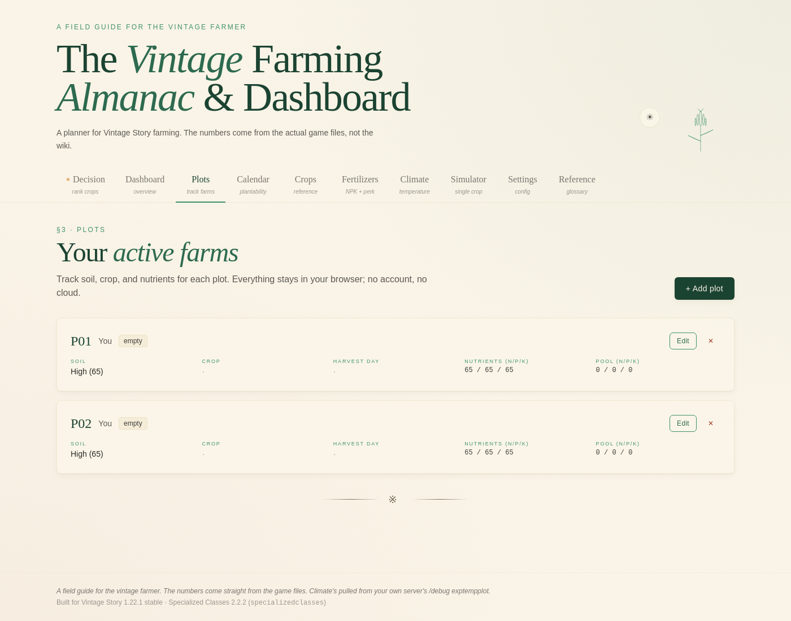

When you set Mode to "Linked to Plots" on the Decision tab, it pulls inputs straight from a tracked plot.

### Calendar · plantability matrix

Every crop on every month, color-coded for plantability. Toggle the greenhouse switch to see the +5°C bonus shift the boundaries.

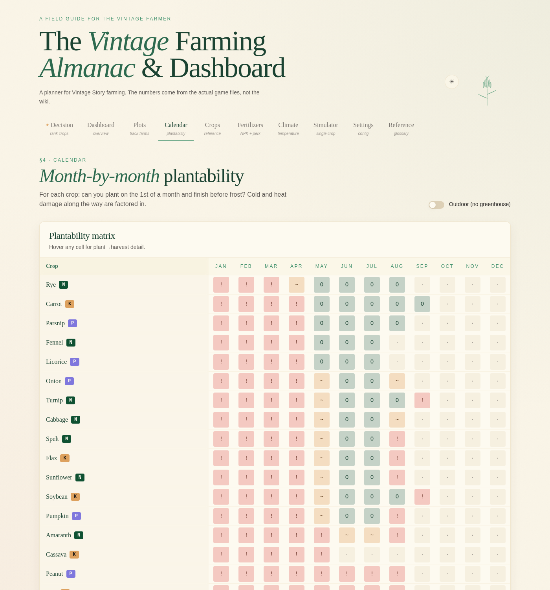

`0` = good to plant, `~` = borderline, `!` = cold/heat damage, `·` = won't finish before frost.

### Crops · the full reference table

All 18 crops with their JSON-verified parameters. Sort by any column.

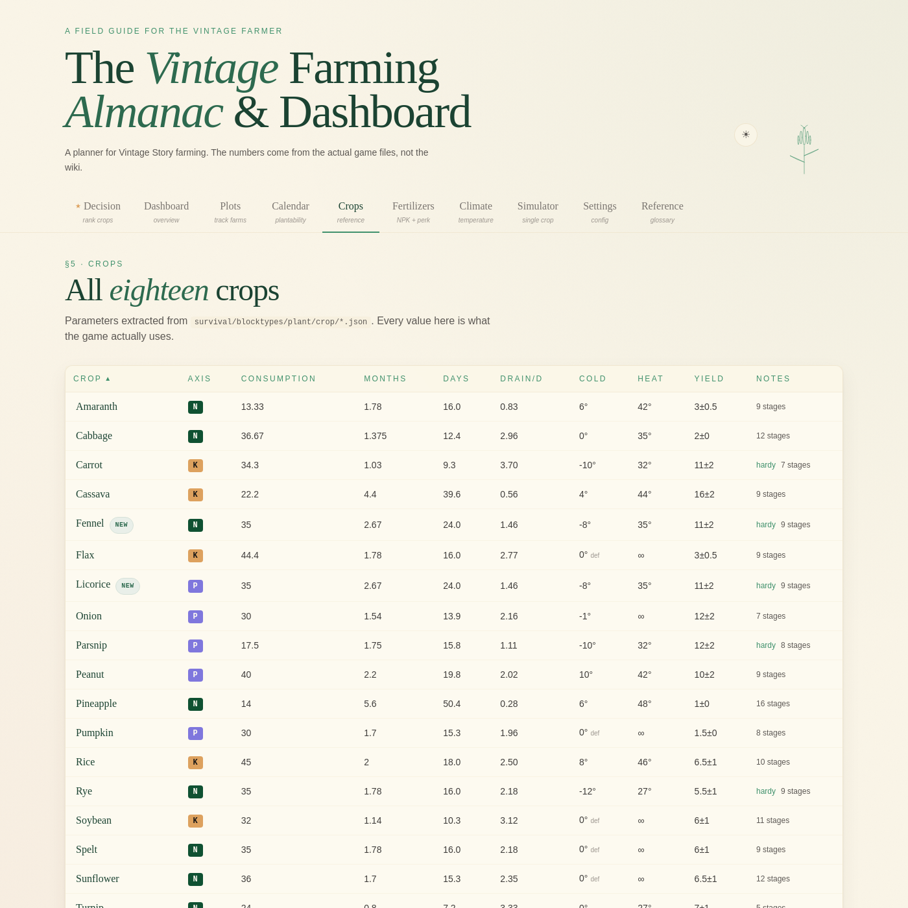

Hardy crops (Carrot, Parsnip, Rye, Fennel, Licorice) are flagged. Crops using C# class defaults instead of JSON values are marked with `def`.

### Fertilizers · NPK and the perk math

The four fertilizers, their NPK profiles, and the slow-release pool dynamics. If you have the Specialized Classes mod, the Farmhand fertilizer perk is here too with a worked example.

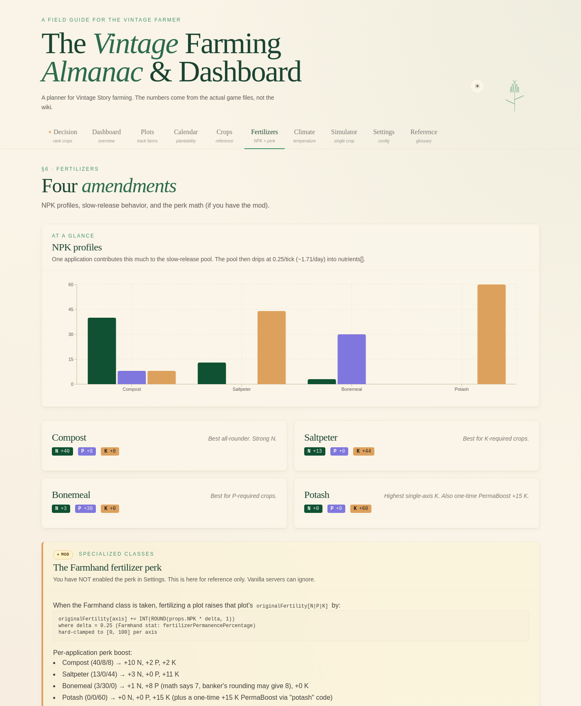

### Climate · your server's annual cycle

108-day temperature curve from your server's `/debug exptempplot` data. Yearly average, coldest/warmest days, and the growing-season window all surface as KPIs.

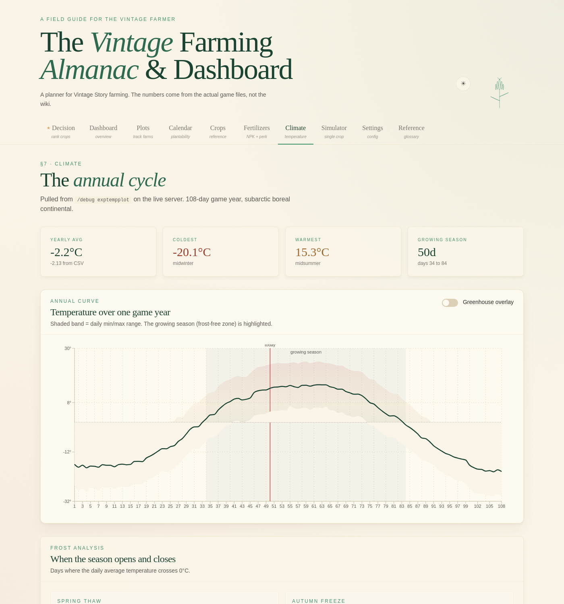

### Settings · config + climate upload

Today's day, days/month, default soil tier, mod compatibility (with the explicit version pin), and a CSV uploader to swap in your own climate data.


### Reference · glossary, formulas, fire safety, underground farming

The deep documentation that doesn't fit on the other tabs. Glossary of terms, the full Decision Helper score formula, fire safety / plot spacing recommendations, and the documented underground-farming bug in 1.22.1.

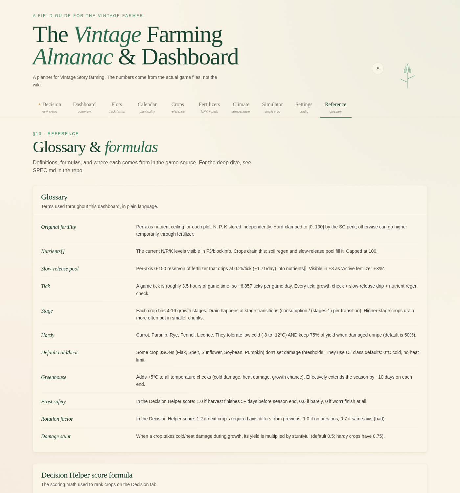

### Dark mode

There's a sun/moon toggle in the header. Persists across visits, follows your OS preference on first load.


---

## What this gives you

- **A Decision Helper** that ranks all 18 crops for your current situation in real time. Inputs: today's day, soil tier, greenhouse, current N/P/K, slow-release pool, perk on/off, fertilizer plan. Output: ranked list with reasoning, top 3 crop chains, frost/temperature warnings, and a nutrient outlook for the recommended pick.
- **A complete climate model** of your server's annual temperature curve (108-day year, subarctic boreal continental, latitude 0.557). Calendar tab shows month-by-month plantability for every crop, with and without greenhouse.
- **All 18 crops fully parameterized** with values from JSON files (post 1.20. The wiki is ~12% off on consumption and ~11% off on grow times).
- **Slow-release fertilizer simulation** that accounts for the per-tick drip from the slow-release pool into nutrients[]. Knows when to recommend Compost vs Saltpeter vs Bonemeal vs Potash based on which crop's required axis benefits most.
- **[MOD] The Specialized Classes "fertilizer" perk math** decompiled from the DLL (only relevant if running this mod). Including the duplicate-guard, the per-axis hard clamp, and the Round(NPK × delta, 1) precision quirk.
- **A complete mechanics reference** below covering everything I learned chasing down what the wiki gets wrong. If you want to know how growthChance, stage advancement, damage muls, or nutrient regen actually work. It's all here, with file:line citations to the source.

---

## Spreadsheet: detailed input reference

1. Open `farming_dashboard.xlsx` in Excel, LibreOffice, or upload to Google Sheets.
2. Go to the **Decision** tab (sheet 2, terracotta tab).
3. Set your inputs in section 1:
   - **Mode**: Standalone (manual entry) or Linked to Plots (pulls from a tracked plot).
   - **Today (day#)**: pulls from Settings; override to test other dates.
   - **Soil tier**: 5 / 25 / 50 / 65 / 80 (Barren / Low / Medium / Compost / Terra Preta).
   - **Greenhouse?**: TRUE adds +5°C to all temperature checks.
   - **Has Farmhand fertilizer perk?** `[MOD]`: pulls from Settings. **Set to FALSE on vanilla servers.**
   - **Will fertilize at planting?** + **Fertilizer to apply**: dropdown for None/Compost/Saltpeter/Bonemeal/Potash. Adds the chosen NPK to your slow-release pool.
   - **Current N/P/K**: post-harvest readings from in-game F3.
   - **Slow-release pool**: 0 to 150 each axis; visible in F3 as "Active fertilizer +X%".
4. Read section 3 for the ranked crop list, section 4 for crop-chain suggestions, section 5 for warnings, and section 6 for the projected nutrient outlook.

---

## What's in the workbook

14 tabs, ordered by typical use:

| Tab | Purpose |
|---|---|
| README | Help text and version notes |
| **Decision** | Primary tool. Ranks crops for your current plot state |
| Dashboard | At-a-glance overview: climate snapshot, plot status, key visualizations |
| Settings | World config (days/month, current day, default soil, `[MOD]` perk on/off) |
| Climate | Hourly temperature data exported from your server (`/debug exptempplot`) |
| Crops | All 18 crops with grow time, consumption, required nutrient, damage params |
| Soils | The 6 soil tiers and their fertility values |
| Fertilizers | Compost / Saltpeter / Bonemeal / Potash NPK, plus `[MOD]` perk progression math |
| Calendar | Month-by-month plantability heatmap for every crop |
| Simulator | Single-crop deep-dive: simulate one plot's full growth |
| Plots | Track active farms. Auto-updates Decision tab in linked mode |
| Rotation | Crop rotation planner with N/P/K nutrient axis grouping |
| ActivityLog | Append-only log for harvests and fertilizer applications |
| Reference | Glossary, formula references, perk math worked example |

---

## Decision Helper: how it works

The Decision tab scores all 18 crops on a unified scale and ranks them. Higher score = better choice. The score rolls together six factors:

```
score = (yield ÷ grow_days × 100)        ← base productivity
        × nutrient_factor                ← effective avg nutrient during growth
        × frost_safety                   ← 1.0 / 0.6 / 0 by harvest day
        × damage_multiplier              ← from temperature window
        × rotation_factor                ← 0.7 / 1.0 / 1.2 by axis fit
        × follow_up_factor               ← 1.3 / 1.1 / 1.0 by chain potential
```

### Nutrient factor (the slow-release-aware bit)

This is where the Decision Helper differs from a naive "current nutrient" check. For each crop:

1. Compute `effective_pool` = `MIN(150, current_pool + IF(applying_fertilizer, fertilizer_NPK, 0))`
2. Compute pool release potential over growth window: `MIN(effective_pool, 0.25 × growth_ticks)`. Capped because slow-release only drips at 0.25/tick.
3. Net drain on required axis = `MAX(0, consumption − pool_release)`.
4. Ending nutrient = `MAX(0, starting − net_drain)`.
5. Average effective nutrient = `(starting + ending) / 2`.
6. Map to growth factor via the game's step function:
   - avg > 75 → 1.10× (top tier)
   - avg > 50 → 1.00×
   - avg > 35 → 0.90×
   - avg > 20 → 0.60×
   - avg > 5 → 0.30×
   - else → 0.10×

**This is what makes the dropdown matter.** A K-required crop with no fertilizer might end up averaging 48 K (factor 0.90×). Apply Saltpeter (+44 K to pool) and the same crop averages 56 K (factor 1.00×). Score jumps ~11%. Apply Compost (+8 K) and it's 52 K (just barely 1.00×). Apply Bonemeal (+0 K) and nothing changes.

### Decision tab in action

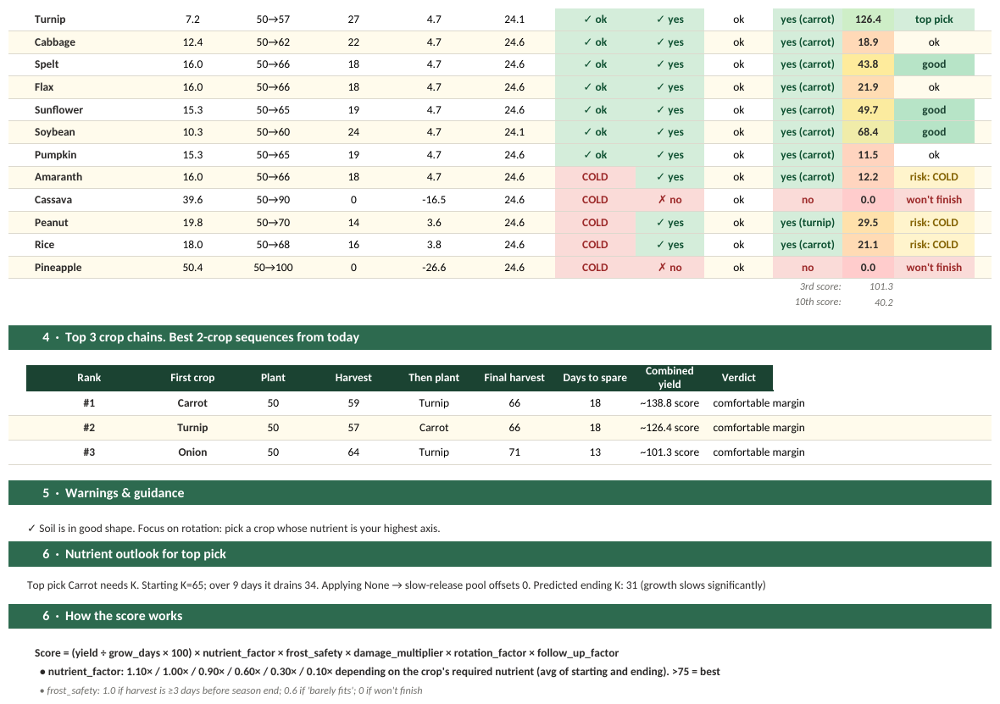

The crop ranking table shows every one of the 18 crops with their grow time, harvest day, frost-window temperatures, cold/heat status, and final score. Top 3 crop chains in section 4 show optimal 2-crop sequences from today (e.g., Carrot → Turnip = 2 harvests in 18 days with rotation bonus). Warnings in section 5 surface season-specific concerns (frost approaching, low nutrients on required axis, rotation suggestions).

---

## Visualizations from the spreadsheet analysis

These charts come from the spreadsheet workbook (and the Python analysis behind it) rather than the live webapp. They illustrate the math the dashboard is built on. If you're using the webapp, you can skip this section; it's for anyone curious about the underlying mechanics or working from the .xlsx file directly.

### Slow-release fertilizer behavior

This is the central mechanic that the workbook simulates. When you apply a fertilizer, its NPK doesn't go directly into `nutrients[]`. It goes into a per-axis `slowReleaseNutrients[]` pool (capped at 150 per axis). Every tick (~3.5h, ~6.857/day) the pool drips up to 0.25 per axis into nutrients[], capped at 100. A full pool of 150 takes ~600 ticks (~87 days) to fully release.

![Slow-release decay and nutrients[] response](./images/slow_release_decay.png)

**Left panel** shows the pool draining linearly at 0.25/tick. **Right panel** shows how nutrients[] responds during a 20-day Rye crop: the consumed N axis (green) shows a sawtooth pattern as stage transitions drain it (each transition removes `consumption / (stages−1)` = 4.4 N), then the slow-release immediately tops it back up. The non-consumed P axis (purple) just rises monotonically toward 65 (originalFertility cap). Threshold lines show the growth-rate tier breakpoints.

### Crop drain rates ranked

The slow-release rate of ~1.71/day (= 0.25/tick × 6.857 ticks/day) sets a natural baseline. Crops that drain *faster* than this need either a high starting nutrient or fresh fertilization to finish strong:

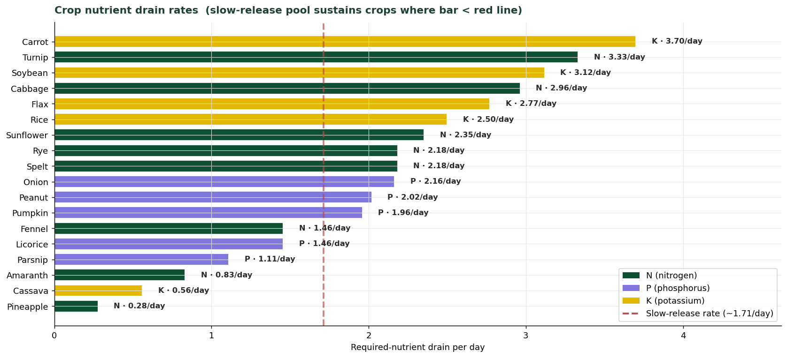

Bars colored by required nutrient axis (N green, P purple, K gold). Crops left of the red line (Carrot 3.7, Turnip 3.3, Soybean 3.1, Cabbage 3.0) outpace the slow-release. Crops right of it (Pineapple 0.28, Cassava 0.56, Amaranth 0.83) are easily sustained.

### Fertilizer choice trajectory

Same crop, five fertilizer scenarios overlaid. Shows which fertilizer matters for which crop:

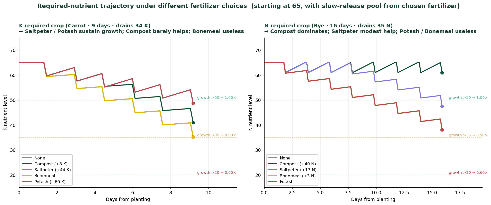

**Left panel (K-required Carrot, 9 days)**: Saltpeter and Potash dominate (both add 44+ K to pool). Compost gives a small boost (+8 K). Bonemeal does literally nothing. It has 0 K. **Right panel (N-required Rye, 16 days)**: Compost dominates (+40 N). Saltpeter is modest (+13 N). Potash and Bonemeal are useless (0 N).

### Climate yearly curve

The user's server is subarctic boreal continental. Growing season is days 34 to 83 (50 of 108 days), yearly mean −2.13°C, first frost at day 84:

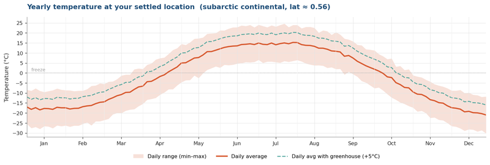

### Plantable days per crop

How many days of the year each crop can finish without frost damage (outdoor + greenhouse):

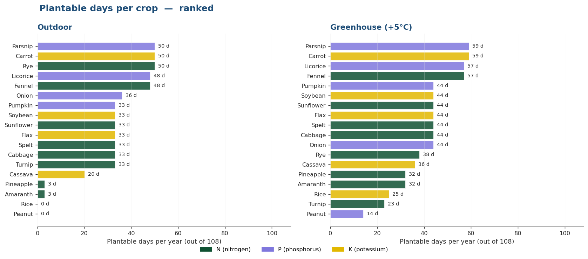

### Cold tolerance comparison

Each crop's `coldDamageBelow` threshold. Crops with no JSON value use the C# class default (effectively 0. So any sub-zero exposure damages them):

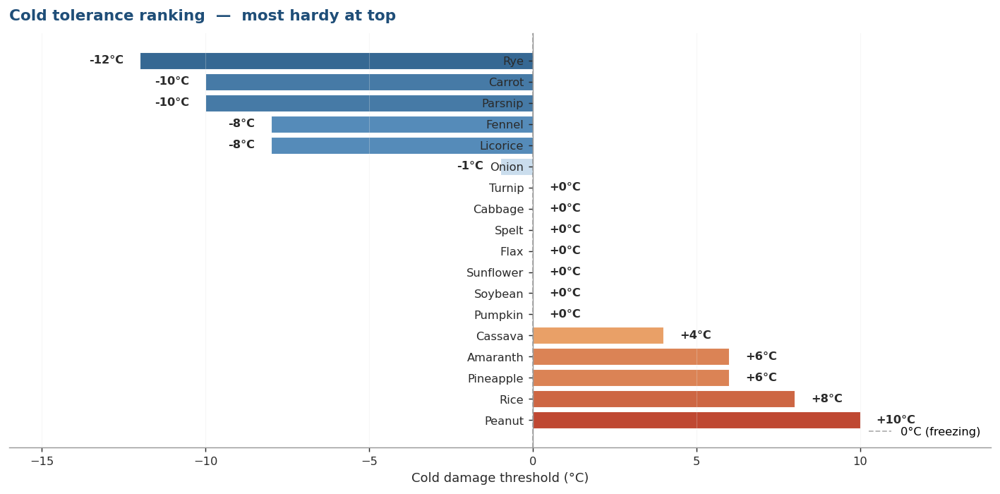

### Time-to-harvest vs yield

The fundamental tradeoff. Lower-left (Turnip, Pumpkin) = quick low yield. Upper-right (Cassava, Pineapple) = slow high yield but only viable in a long greenhouse season:

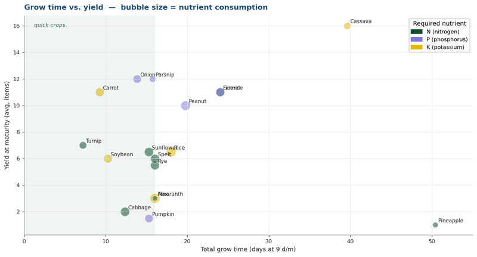

### Calendar: outdoor

Month-by-month plantability matrix. Green = plantable, red = cold damage risk, yellow = will frost before ripening:

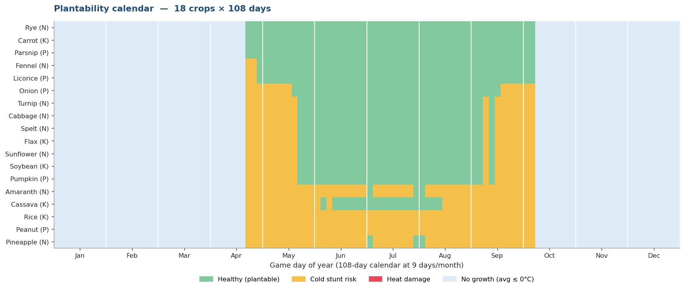

### Calendar: greenhouse

Same crops with +5°C greenhouse bonus. Notably extends the season for Carrot, Onion, Cabbage. Doesn't help tropical crops enough (Cassava, Pineapple still fail in subarctic):

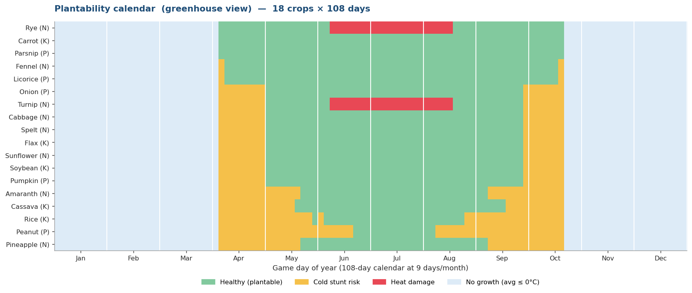

### Fertilizer NPK comparison

The four fertilizers and their immediate slow-release contributions:

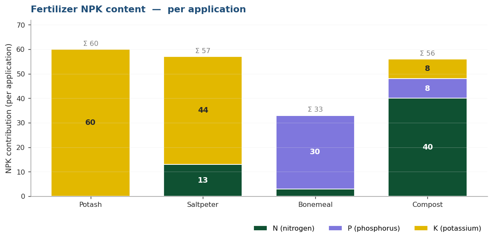

### Soil tier fertility values

The six soil tiers and what each provides. **Bony soil = 30, not 0** (wiki is wrong) and Bony is **NOT tillable** (its block code is `bonysoil`, not `soil-bony`):

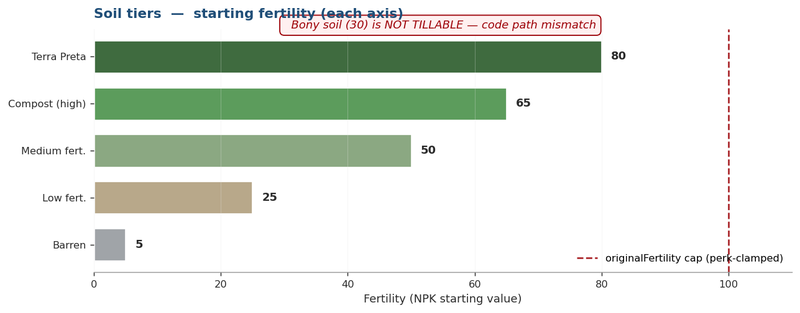

### `[MOD]` Specialized Classes perk progression

*Only relevant if you have the [Specialized Classes mod](https://mods.vintagestory.at/specializedclasses) installed.* The Farmhand fertilizer perk's effect over repeated applications. Each application of Compost adds +10/+2/+2 to originalFertility (rounded `Round(NPK × 0.25, 1)`). Hard-clamped to [0, 100] per axis:

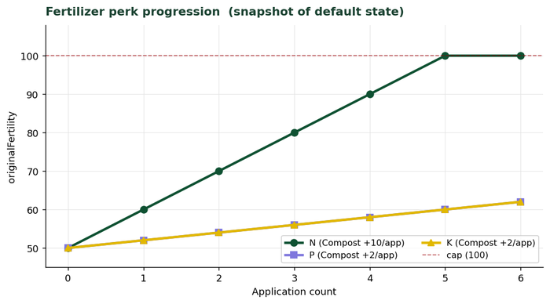

### Dashboard composite (spreadsheet)

The full Dashboard tab from the spreadsheet, assembled into one view. Climate snapshot, growing-season indicator, top-5 plantable crops:

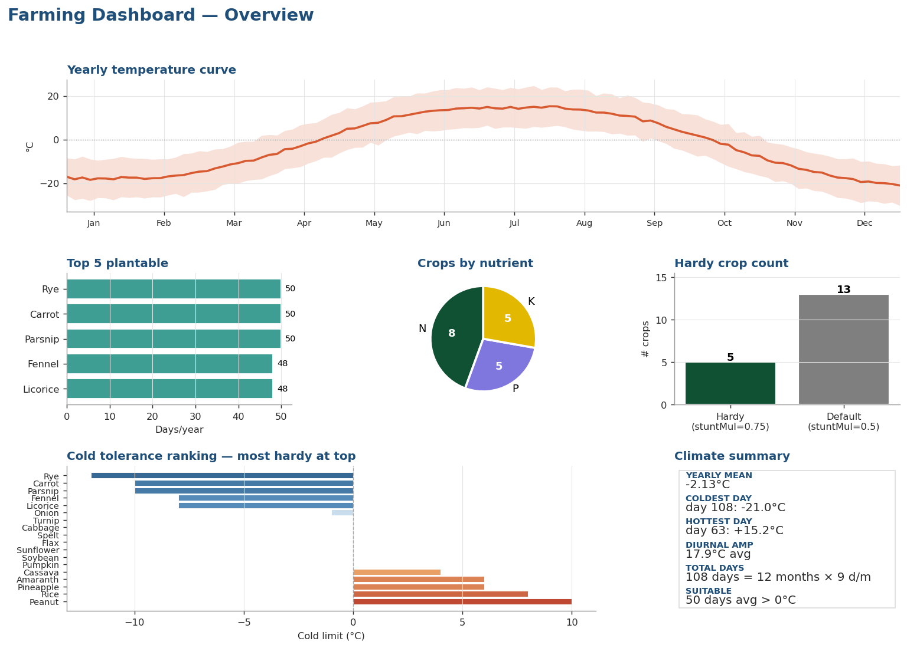

### Dashboard tab in the spreadsheet

What the Dashboard tab looks like inside the workbook itself:

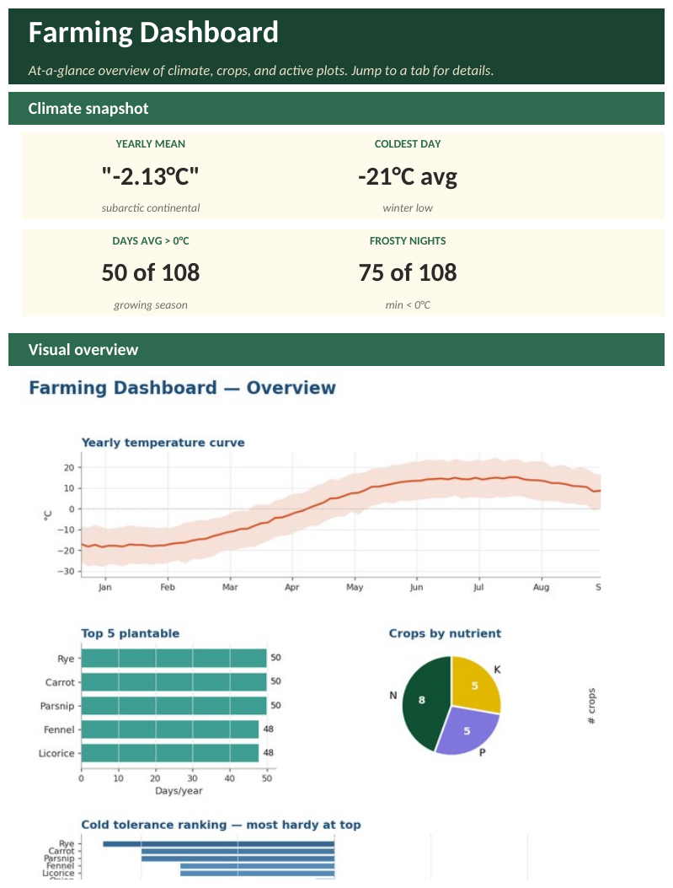

---

## Cross-tab consistency

The workbook has been audited across 12 dimensions; all checks pass:

- **23 active named ranges**: all defined and used (22 unused stale ranges from earlier phases were cleaned up)
- **17,431 cross-tab references**: every `Sheet!Cell` reference resolves to a real cell with data
- **18 crops consistent** across Crops, Calendar, Decision, Rotation tabs
- **4 fertilizers** with verified NPK matching the JSON values
- **6 soil tiers** matching the game's `BESoilNutrition.Fertilities`
- **SeasonEndDay = 84** computed from the climate frost-flag column
- **Settings propagation** verified. Changing CurrentDay, HasPerk, etc. flows through to all dependents
- **Linked-mode** verified. Decision pulls Soil and Greenhouse from the selected plot
- **Greenhouse adds +5°C** to all window-min and window-max temps (verified across all 18 crops)
- **Score monotonicity**: worse conditions never score higher (138.8 baseline → 46.3 low soil → 0 late season)
- **16 input states tested**: zero formula errors in any state
- **3,501 formulas, 0 errors**

---

## §0. What's Different From the Wiki (Read This First)

Multiple things in the wiki are out of date or wrong. Trusting the wiki without verification is how the v1 dashboard ended up with bad numbers. Headlines:

1. **All crop growth times are ~11% shorter than the wiki claims**, and **all nutrient consumption values are ~12% lower**. The wiki uses pre-1.20 values; JSONs show current values.
2. **Two crops the wiki doesn't list**: Fennel and Licorice (both temperate, full damage parameters set).
3. **Damage muls are SWAPPED for hardy crops.** Wiki said carrot/parsnip/rye keep 75% on ripe-cold damage. JSON says they keep 75% on **unripe damage** and only 50% on ripe-cold damage. Better behavior than the wiki described, but inverted.
4. **Many crops have NO cold/heat tolerance set in their JSONs** at all (Flax, Spelt, Sunflower, Soybean, Pumpkin). They use C# class defaults. Likely 0 for cold (so cold damage starts at any sub-zero) and a high default for heat.
5. **Bony soil fertility is 30, not 0** (per wiki). Bony soil is **NOT tillable** (hoe code path-checks for `"soil-..."` prefix; bony's code is `"bonysoil"`).
6. **`[MOD]` The Specialized Classes perk hard-clamps `originalFertility` to [0, 100]** per axis. My v2 SPEC said "no cap". I had it wrong.
7. **`growthPaused` is probabilistic per tick**, not binary. The "10% per degree below 10°C" rule from the wiki is correct *as a per-tick probability of skipping growth*, not as a continuous slowdown.
8. **`lightGrowthSpeedFactor` is light-only** (not combined with temperature). The wiki and the variable name suggest it covers both; the parent class code shows it's purely a sunlight calculation.
9. **The fertility regen "cold penalty"** the wiki describes IS in the code, but as a per-tick growthPaused dice roll (not a continuous reduction). Same dice roll governs crop growth and fertility regen. Both stop together.
10. **Tick interval is uniformly 3.0 to 4.0 hours**, mean 3.5h. Each tick the next interval is freshly randomized.
11. **Farmhand's `harvester` trait stats are mostly dead code.** The trait defines `cropProduceDropRate: 0.5`, `cropSeedDropRate: 1`, `wildCropDropRate: 1`, `youngseeddropchance: 1`. Of these, ONLY `wildCropDropRate` is read by vanilla code, AND ONLY for wild crops (when `befarmland == null` in `BlockCrop.GetDrops`). For farmed crops, none of these stats have any effect. Verified by grepping the entire `vssurvivalmod-master` C# source AND the SC mod's compiled DLL. No references to the other 3 stats anywhere. **The Farmhand class gets NO yield bonuses on farmed crops from these stats.** Only the `fertilizer` trait (originalFertility perk) has any effect on farmed crops.

---

## Table of Contents

0. What's different from the wiki
1. Time and update intervals
2. Soil tiers and tillability
3. Farmland creation and moisture
4. Growth rate. The actual code formula
5. Stage advancement
6. Damage, death, and yield reduction
7. Nutrient regeneration and slow-release
8. Fertilizers
9. Specialized Classes "Fertilizer" perk (full IL decompilation)
10. Crop reference table (JSON-verified, all 18 plantable crops)
11. Temperature model
12. The user's actual climate (CSV analysis)
13. Rooms, greenhouses, cellars
14. Fire safety and plot spacing
15. Underground farming and light (the live bug in 1.22.1)
16. Server config keys
17. Wild crops, weeds, hares, salt
18. What we cannot deterministically simulate
19. Open questions
20. Implementation checklist

---

## §1. Time and Update Intervals

### 1.1 Real-time conversion (hardcoded, not config)

- **1 game-hour = 2 IRL minutes**
- 1 game-day = 24 game-hours = **48 IRL minutes**
- 1 game-month = `DaysPerMonth × 48` IRL minutes
- 1 game-year = `DaysPerMonth × 12 × 48` IRL minutes

At default 9 days/month: 1 game-day = 48 min IRL, 1 game-month = 7.2 hr IRL, 1 game-year = 86.4 hr IRL ≈ 3.6 IRL days.

### 1.2 Calendar config

- `DaysPerMonth`. Server config (`/worldconfig daysPerMonth`). Default **9**.
- `MonthsPerYear`. Fixed at 12 in the engine.
- World spawn date: **May 1**, year 1386.
- Seasons: each season = 3 months = 27 days at default 9 d/m.

### 1.3 The tick interval: exact code

`BlockEntityFastForwardGrowth.Update()`:

```csharp
double hourIntervall = 3 + rand.NextDouble();
```

So **each tick interval is uniformly random in [3.0, 4.0) hours**, mean 3.5h. Every tick a fresh random is drawn for the next interval.

The polling registration is:
```csharp
RegisterGameTickListener((dt) => { ... }, 4500, rand.Next(4500));
```

The BE polls every 4500ms IRL with a random offset, but actual processing only fires when `hoursSinceLastUpdate >= hourIntervall`.

Average ticks per game-day: 24/3.5 = **6.857 ticks/day**.

### 1.4 Time of day

Hottest hour = **4 PM** (16:00). Coldest hour = **4 AM** (4:00). Diurnal temperature swing is symmetric around the daily mean. See §11.

---

## §2. Soil Tiers and Tillability

### 2.1 Internal codes vs in-game names

From `survival/worldproperties/abstract/fertility.json` and `BESoilNutrition.cs`:

```csharp
public static OrderedDictionary<string, float> Fertilities = new()
{
    { "verylow", 5 },
    { "low",     25 },
    { "medium",  50 },
    { "compost", 65 },
    { "high",    80 }
};
```

| Internal code | Numeric | In-game name             | Worldgen?        | Source                                              |
|---------------|---------|--------------------------|------------------|------------------------------------------------------|
| `verylow`     | 5       | Barren                   | Rare (in ruins)  | Found in surface ruins                               |
| `low`         | 25      | Low fertility            | Yes (most common)| Found everywhere; forest floor drops as low          |
| `medium`      | 50      | Medium fertility         | Yes              | Found in regions with common rainfall                |
| `compost`     | 65      | High fertility (natural) | Yes (post-1.19)  | Found as deposits in temperate areas                 |
| `high`        | 80      | Terra Preta              | **Crafted only** | 16 compost + 8 bonemeal + 8 powdered charcoal        |

### 2.2 Bony soil: separate block, NOT tillable

From `survival/blocktypes/soil/bony.json`:

```json
{
    "code": "bonysoil",
    "fertility": 30,
    "attributes": {
        "pannable": true,
        "pannedBlock": "bonysoil-7"
    }
}
```

**Two key facts:**

1. **Bony soil's fertility attribute is 30**, not 0 as the wiki claims. (This is the block's `fertility` attribute used for wild plant generation. Not a farmland tier.)
2. **Bony soil is NOT tillable.** From `ItemHoe.cs` `DoTill()`:

```csharp
if (!block.Code.PathStartsWith("soil")) return;
```

Regular soils have codes like `soil-medium-grassy` (start with "soil"). Bony's code is `"bonysoil"`. Does NOT start with "soil". The hoe rejects it. **Bony soil cannot be made into farmland.** Its purpose is panning to find ancient items.

### 2.3 Forest floor: special

A separate block found only in forests. Drops as **low fertility soil (25%)** when broken.

### 2.4 Worldgen rules for natural compost-65

- Spawns as deposits within Low or Medium fertility soils
- Temperate regions only (not very low temperature)
- "Common" or "very common" rainfall regions
- NOT above 1.53× sea level (sea level = 110 → cap ≈ Y=168)

For the user's subarctic location, natural compost-65 will be hard to find at home. Sourcing from temperate areas via expedition or crafting Terra Preta is the realistic path.

### 2.5 Soil fertility persistence

Plain soil blocks (any tier) **retain their fertility variant** when broken and replaced. So you can excavate Medium soil from a temperate region and bring it home. Once **tilled**, the farmland block is no longer pickup-able.

### 2.6 The unknown-variant fallback

`BESoilNutrition.OnCreatedFromSoil()`:

```csharp
string strfertility = block.Variant["fertility"];
float val = 0;
if (strfertility == null || !Fertilities.TryGetValue(strfertility, out val)) val = 25;
```

If the soil block's `fertility` variant is missing or unrecognized, defaults to **25** (low).

### 2.7 Per-nutrient originalFertility

When a soil tier is tilled, **all three nutrients (N, P, K) start at the tier's fertility level**. `originalFertility` is stored as `int[3]` so each axis can be independently boosted.


---

## §3. Farmland Creation and Moisture

### 3.1 Tilling (`ItemHoe.DoTill()`)

```csharp
if (!block.Code.PathStartsWith("soil")) return;

string fertility = block.LastCodePart(1);
Block farmland = byEntity.World.GetBlock(new AssetLocation("farmland-dry-" + fertility));

TreeAttribute prevData = null;
var besn = byEntity.World.BlockAccessor.GetBlockEntity(pos) as BlockEntitySoilNutrition;
if (besn != null) {
    prevData = new TreeAttribute();
    besn.ToTreeAttributes(prevData);
}

byEntity.World.BlockAccessor.SetBlock(farmland.BlockId, pos);
slot.Itemstack?.Collectible.DamageItem(byEntity.World, byEntity, byPlayer.InventoryManager.ActiveHotbarSlot);

BlockEntity be = byEntity.World.BlockAccessor.GetBlockEntity(pos);
if (be is BlockEntityFarmland bef) {
    bef.OnCreatedFromSoil(block, prevData);
}
```

Tilling preserves any pre-existing nutrition data via the `prevData` path. For a fresh till, it's null and BE initializes at the soil tier's fertility.

### 3.2 Moisture from nearby water

`BESoilNutrition.GetNearbyWaterDistance()`:

```csharp
Api.World.BlockAccessor.SearchFluidBlocks(
    new BlockPos(Pos.X - 4, Pos.Y, Pos.Z - 4),
    new BlockPos(Pos.X + 4, Pos.Y, Pos.Z + 4),
    (block, pos) => {
        if (block.LiquidCode == "water")
            waterDistance = Math.Min(waterDistance,
                Math.Max(Math.Abs(pos.X - Pos.X), Math.Abs(pos.Z - Pos.Z)));
        ...
    }
);
```

- Search range: **9×9 horizontal box** at the same Y level (Pos±4 in X and Z)
- Distance metric: **Chebyshev** (max of |dx|, |dz|), so diagonals count
- Vertical water doesn't count
- Saltwater is detected for damage (§17.4) but provides no moisture

Moisture from water source:
```csharp
float minMoisture = GameMath.Clamp(1 - waterDistance / 4f, 0, 1);
```

| Distance | minMoisture |
|----------|-------------|
| 1 | 0.75 |
| 2 | 0.50 |
| 3 | 0.25 |
| 4+ | 0.00 |

### 3.3 Moisture from rain

Per game-hour while sky-exposed:
```csharp
moistureLevel = clamp(moistureLevel + rainLevel/3f, 0, 1)
```

Sky-exposed check uses `Pos.Y + RainHeightOffset`. `RainHeightOffset = 1` when a crop is planted (the crop block above blocks rain by 1).

### 3.4 Watering can

`WaterFarmland(dt)`: `moistureLevel = min(1, moistureLevel + dt/2)`. Plus splashes 4 horizontal neighbors at `dt/3` each. Not relevant for the user's water-adjacent strategy.

### 3.5 Moisture decay

```csharp
totalHoursWaterRetention = HoursPerDay × 4 = 96
moistureLevel = max(minMoisture, moistureLevel − hoursPassed/96)
```

Fully-saturated plot with no water source decays to 0 over 96 game-hours = **4 game-days**.

### 3.6 Growth halts below 10% moisture

`BEFarmland.beginIntervalledUpdate()`:
```csharp
if (moistureLevel < 0.1) return;
```

Crop doesn't grow at all below 10%.

### 3.7 The user's standard plot: 75% moisture

Per design (every plot adjacent to still water): **moistureLevel = 0.75 always**. Growth rate moisture factor at 75% (per §4.1) is **0.974**: a strong default.

---

## §4. Growth Rate (How the Game Actually Computes It)

### 4.1 Moisture factor (continuous power formula, NOT stepped)

`BESoilNutrition.GetGrowthRate()`:

```csharp
float moistFactor = (float)Math.Pow(Math.Max(0.01, moistureLevel * 100 / 70 - 0.143), 0.35);
```

| Moisture | Wiki | Code | Match? |
|----------|------|------|--------|
| 10% | ~20% | 0.001^0.35 → 0.01 (clamped) | wiki misleading |
| 25% | ~58% | 0.575 | ✓ |
| 50% | ~82% | 0.823 | ✓ |
| **75%** | **~97%** | **0.974** | ✓ |
| 100% | ~109% | 1.092 | ✓ |

For the user's standard plot: **moistFactor = 0.974**.

### 4.2 Nutrient factor (stepped, strictly `>`)

```csharp
return nutrients[(int)nutrient] switch
{
    > 75 => moistFactor * 1.1f,
    > 50 => moistFactor * 1,
    > 35 => moistFactor * 0.9f,
    > 20 => moistFactor * 0.6f,
    > 5  => moistFactor * 0.3f,
    _    => moistFactor * 0.1f
};
```

**Strict `>`**: exactly 50% nutrient → 0.9× factor (not 1.0×). Exactly 75% → 1.0× (not 1.1×).

| Current nutrient | Multiplier |
|------------------|------------|
| > 75 | × 1.10 |
| > 50, ≤ 75 | × 1.00 |
| > 35, ≤ 50 | × 0.90 |
| > 20, ≤ 35 | × 0.60 |
| > 5, ≤ 20 | × 0.30 |
| ≤ 5 | × 0.10 |

`GetGrowthRate()` returns this combined `moistFactor × nutrient_step`. The result is the green/yellow/red percentage in the farmland block info HUD.

### 4.3 Light factor: `lightGrowthSpeedFactor`

`BlockEntityFastForwardGrowth.Update()`:

```csharp
int lightpenalty = 0;
if (!allowundergroundfarming) {
    lightpenalty = Math.Max(0, world.SeaLevel - Pos.Y);
}
int sunlight = blockAccessor.GetLightLevel(upPos, 
    allowundergroundfarming ? EnumLightLevelType.MaxLight : EnumLightLevelType.OnlySunLight);

double lightGrowthSpeedFactor = GameMath.Clamp(
    1 - (msFarming.Config.DelayGrowthBelowSunLight - (sunlight - lightpenalty)) * msFarming.Config.LossPerLevel,
    0, 1);
```

Per `farming.json`: `DelayGrowthBelowSunLight = 19`, `LossPerLevel = 0.1`.

| Effective sunlight | Factor |
|--------------------|--------|
| ≥ 19 | 1.00 |
| 18 | 0.90 |
| 17 | 0.80 |
| ... | ... |
| 10 | 0.10 |
| ≤ 9 | 0.00 |

**Important: `lightGrowthSpeedFactor` is purely sunlight.** Despite the name, no temperature component.

For user at Y≈110 (sea level), `lightpenalty = 0`. Outdoor full sunlight (level 22): factor = 1.0.

### 4.4 Temperature factor: the actual mechanism

Temperature is NOT applied as a static factor. Per `BlockEntityFastForwardGrowth.Update()`:

```csharp
if (roomness > 0) conds.Temperature += 5;  // Greenhouse +5°C applied here

double growthChance = 1 + (conds.Temperature - delayGrowthBelowTemperature) * lossPerDegree;
// delayGrowthBelowTemperature = 10, lossPerDegree = 0.1
// → growthChance = 1 + (T - 10) × 0.1

bool growthPaused = rand.NextDouble() > growthChance;
```

The wiki's "10% growth penalty per degree below 10°C" is correct **on average per tick**, but applied as a Bernoulli trial each tick rather than continuous slowdown.

| Temperature | growthChance | P(grows this tick) |
|-------------|--------------|---------------------|
| ≥ 10°C | 1.00 | 100% |
| 9°C | 0.90 | 90% |
| 5°C | 0.50 | 50% |
| 1°C | 0.10 | 10% |
| ≤ 0°C | 0.00 | 0% |

When `growthPaused = true`, the BEFarmland callback does:
```csharp
if (growthPaused) {
    totalHoursForNextStage += previousHourInterval;
    return;
}
```

Pushes the deadline AND skips the rest of tick logic. Both growth and fertility regen pause together (both live in same `onInterval`).

### 4.5 The dynamic delay accumulation

`BEFarmland.beginIntervalledUpdate()` per tick:

```csharp
totalHoursForNextStage += hourIntervall * (1 - lightGrowthSpeedFactor);
```

If `lightGrowthSpeedFactor < 1.0` (subpar light), the deadline gets pushed by the unaccounted-for time.

### 4.6 GrowthRateMul (server config)

`cropGrowthRateMul`, default 1.0. Flat multiplier:
```csharp
return stageHours / growthRateMul;
```

### 4.7 Combined effective rate at user's plot

For 75% moisture, full sunlight, default GrowthRateMul=1:

```
effective_growth_per_hour ≈ moistFactor × nutrient_step × growthChance(T)
                          = 0.974 × nutrient_step × P(grows | T)
```

For Terra Preta plot (80 K starting):
- T = 15°C: 0.974 × 1.10 × 1.0 = **1.071** (7.1% faster than baseline)
- T = 5°C: 0.974 × 1.10 × 0.5 = **0.536** (54%)
- T = 0°C: 0.974 × 1.10 × 0.0 = **0.0** (no growth)

### 4.8 Stage time formula (`BEFarmland.GetHoursForNextStage()`)

```csharp
var totalDays = block.CropProps.TotalGrowthDays;
if (totalDays > 0) {
    var defaultTimeInMonths = totalDays / 12;
    totalDays = defaultTimeInMonths * Api.World.Calendar.DaysPerMonth;
} else {
    totalDays = block.CropProps.TotalGrowthMonths * Api.World.Calendar.DaysPerMonth;
}

float stageHours = Api.World.Calendar.HoursPerDay * totalDays / Math.Max(1, block.CropProps.GrowthStages - 1);

stageHours *= 1 / GetGrowthRate(block.CropProps.RequiredNutrient);
stageHours *= (float)(0.9 + 0.2 * rand.NextDouble());
return stageHours / growthRateMul;
```

- The growth rate at stage START (moisture × nutrient) is baked into the planned stage time
- Per-tick light delays accumulate ON TOP via `+= hourIntervall × (1 − lightGrowthSpeedFactor)`
- Per-tick temperature is the `growthPaused` Bernoulli mechanism
- ±10% random is fresh per stage

---

## §5. Stage Advancement and Drain

### 5.1 Stages

A crop with `growthStages = N` cycles through stages 1, 2, ..., N. Total transitions = N − 1. The crop is "ripe" / "mature" / "harvestable" at stage N.

### 5.2 Per-stage drain

`BEFarmland.ConsumeNutrients(cropBlock)`:

```csharp
float nutrientLoss = cropBlock.CropProps.NutrientConsumption / Math.Max(1, cropBlock.CropProps.GrowthStages - 1);
ConsumeNutrients(cropBlock.CropProps.RequiredNutrient, nutrientLoss);
```

Drain happens **at each stage transition**, AFTER the new stage block is placed. Total lifetime drain = `NutrientConsumption` over `GrowthStages − 1` transitions.

### 5.3 Drain on the OLD crop block

```csharp
public bool TryGrowCrop(double currentTotalHours) {
    Block block = GetCrop();              // current crop, BEFORE transition
    ...
    SetBlock(nextBlock.BlockId, upPos);   // transition
    ConsumeNutrients(block);              // drains using OLD block's properties
}
```

Doesn't matter in practice since all stages share the same `CropProps`.


---

## §6. Damage, Death, and Yield Reduction

### 6.1 Damage threshold checks

`BEFarmland.updateCropDamage()`:

```csharp
if (T < ColdDamageBelow) {
    if (hasRipeCrop) {
        ripeCropColdDamaged = true;             // sticky flag, no accumulation
    } else {
        unripeCropColdDamaged = true;
        damageAccum[TooCold] += hourIntervall;
    }
} else {
    damageAccum[TooCold] = max(0, damageAccum[TooCold] − hourIntervall/10);
}

if (T > HeatDamageAbove && hasCrop) {
    unripeHeatDamaged = true;                   // sticky flag (misnamed. Fires for ripe too)
    damageAccum[TooHot] += hourIntervall;
} else {
    damageAccum[TooHot] = max(0, damageAccum[TooHot] − hourIntervall/10);
}
```

### 6.2 Cold-vs-heat asymmetry on ripe crops

| Condition | Unripe | Ripe |
|-----------|--------|------|
| T < ColdDamageBelow | flag + accum (CAN die) | flag, **NO accum**, **cannot die from cold** |
| T > HeatDamageAbove | flag + accum (CAN die) | flag + accum (**CAN die from heat**) |

### 6.3 Damage flags are sticky

The booleans `unripeCropColdDamaged`, `unripeHeatDamaged`, `ripeCropColdDamaged` reset only when:
- Crop is broken / harvested (`OnCropBlockBroken()`)
- Crop dies (replaced by deadCropBlock)
- Empty plot tick clears all flags

A single overnight cold snap permanently flags the crop. The accumulator decays to prevent death, but the **flag stays set** for the crop's lifetime.

### 6.4 Damage accumulator decay rate

`damageAccum -= hourIntervall/10` when condition not met. 1/10 the accumulation rate. 24h cold = 24h damage = 240h to fully decay. Death at 48h cumulative.

### 6.5 Salt damage: DOES NOT DECAY

`BESoilNutrition.GetNearbyWaterDistance()`:
```csharp
if (saltWater) damageAccum[(int)(EnumCropStressType.Salt)] += hoursPassed;
```

**No decay branch for salt damage.** Accumulates monotonically until 48h death.

### 6.6 Death threshold

```csharp
if (dmg > 48) {
    SetBlock(deadCropBlock.Id, upPos);
    be.Inventory[0].Itemstack = new ItemStack(cropBlock);
    be.deathReason = (EnumCropStressType)i;
}
```

48h of any single damage type → dead crop. Death only fires if `allowCropDeath = true` (default).

When `allowCropDeath = false`: `damageAccum[i] = 0` is forced every tick → crops never die, but sticky yield-reduction flags still apply.

### 6.7 Yield mul priority

`BEFarmland.GetDrops()`:

```csharp
float mul = 1f;
if (ripeCropColdDamaged) mul = cropProps.ColdDamageRipeMul;
if (unripeHeatDamaged || unripeCropColdDamaged) mul = cropProps.DamageGrowthStuntMul;
if (isDead) mul = beDeadCrop.deathReason == EnumCropStressType.Eaten 
                  ? 0 
                  : Math.Max(cropProps.ColdDamageRipeMul, cropProps.DamageGrowthStuntMul);
```

Sequential overrides:

| State | Final mul |
|-------|-----------|
| Healthy | 1.0 |
| Ripe-cold-damaged ONLY | `ColdDamageRipeMul` |
| Unripe damage ONLY | `DamageGrowthStuntMul` |
| BOTH ripe-cold AND unripe damage | `DamageGrowthStuntMul` (unripe wins) |
| Dead from cold/heat/salt | `max(ColdDamageRipeMul, DamageGrowthStuntMul)` |
| Dead from Eaten (hare) | 0 (no produce, seed still drops) |

### 6.8 The `harshWinters` global override

```csharp
if (!Api.World.Config.GetString("harshWinters").ToBool(true)) return drops;
```

If `harshWinters = false`, all damaged drop muls are bypassed → full yield even from damaged/dead crops.

### 6.9 `debuffUnaffectedDrops`: exempted from mul

```csharp
string[] debuffUnaffectedDrops = Block.Attributes?["debuffUnaffectedDrops"].AsArray<string>();
if (WildcardUtil.Match(debuffUnaffectedDrops, stack.Collectible.Code.ToShortString())) {
    stacks.Add(stack);
    continue;
}
```

**Verified**: NONE of the 18 plantable crop JSONs in the current asset pack set this attribute. So all drops (seeds AND produce) are subject to the damage mul currently.

### 6.10 Probabilistic drop rounding

```csharp
float q = stack.StackSize * mul;
float frac = q - (int)q;
stack.StackSize = (int)q + (Api.World.Rand.NextDouble() > frac ? 1 : 0);
```

Inverted from standard stochastic rounding. Code rounds up with probability `(1 − frac)`.

| q | code's expected | "intended" |
|---|-----------------|------------|
| 5.5 | 5.5 ✓ | 5.5 |
| 0.25 | 0.75 | 0.25 |
| 0.75 | 0.25 | 0.75 |
| 1.0 | 2.0 (always +1) | 1.0 |

**For Cabbage**: yield 2, default mul 0.5 → q=1.0 → frac=0 → P(rand>0)=1 → **always drops 2** (no penalty). The wiki's "25% chance per cabbage to drop produce when damaged" claim doesn't match the code. ⚠️ **OPEN**: in-game test.

### 6.11 Default values for unset cropProps fields

The `CropProperties` class is in vsapi (no source in our copy). Defaults inferred from JSON inspection + observed game behavior:

- `coldDamageBelow` defaults to **0** (cold damage at sub-zero). Matches "all crops stop growing at 0°C"
- `heatDamageAbove` defaults to a **sentinel** like 9999 or float.MaxValue. Never triggers
- `coldDamageRipeMul` defaults to **0.5**
- `damageGrowthStuntMul` defaults to **0.5**

**For the v2 build, use these defaults for crops with unset fields** (Flax, Spelt, Sunflower, Soybean, Pumpkin) and flag for in-game verification.

---

## §7. Nutrient Regeneration and Slow-Release

### 7.1 The exact regen formula

`BESoilNutrition.updateSoilFertility()`, called every tick when `growthPaused = false`:

```csharp
fertilityRecoverySpeed = 0.25;  // server-configurable

float[] npkRegain = new float[3];
npkRegain[0] = recoverFertility ? fertilityRecoverySpeed : 0;
npkRegain[1] = recoverFertility ? fertilityRecoverySpeed : 0;
npkRegain[2] = recoverFertility ? fertilityRecoverySpeed : 0;

if (currentlyConsumedNutrient != null) {
    npkRegain[(int)currentlyConsumedNutrient] /= 3;  // → 0.0833
}

for (int i = 0; i < 3; i++) {
    nutrients[i] += Math.Max(0, 
        npkRegain[i] + Math.Min(0, originalFertility[i] - nutrients[i] - npkRegain[i]));

    if (slowReleaseNutrients[i] > 0) {
        float release = Math.Min(0.25, slowReleaseNutrients[i]);
        nutrients[i] = Math.Min(100, nutrients[i] + release);
        slowReleaseNutrients[i] -= release;
    } else {
        if (nutrients[i] > originalFertility[i]) {
            nutrients[i] = Math.Max(originalFertility[i], nutrients[i] - 0.05);
        }
    }
}
```

### 7.2 RecoverFertility flag

`BEFarmland.RecoverFertility => GetCrop() == null || !HasRipeCrop();`

- Empty plot: true
- Crop growing: true
- Crop ripe (final stage): false → regen halts entirely

### 7.3 Per-tick rates

| Plot state | Consumed N regen | Other nutrients regen |
|------------|------------------|------------------------|
| Empty | 0.25/tick | 0.25/tick |
| Growing | 0.0833/tick | 0.25/tick |
| Ripe | 0 | 0 |

At 6.857 ticks/day: empty plot regenerates 1.71%/day, growing plot consumed nutrient 0.57%/day, others 1.71%/day.

### 7.4 The clamping math

`nutrients[i] += max(0, npkRegain[i] + min(0, originalFertility[i] - nutrients[i] - npkRegain[i]))` is equivalent to:
- Add npkRegain if it doesn't push above originalFertility
- Add only enough to reach originalFertility otherwise
- Add 0 if already at/above originalFertility

So natural regen **never pushes nutrients above originalFertility**. To exceed, you need slow-release.

### 7.5 Slow-release independent of state

After natural regen, slow-release runs unconditionally for any pool > 0:
- Releases up to 0.25/tick (or whatever's left)
- Caps current nutrient at **100**
- Independent of crop state, growth state, ripeness

A maxed pool of 150 releases for 600 ticks (~87 days) at 0.25/tick. Longer than any crop's life.

### 7.6 Decay above originalFertility

When slow-release pool is empty AND current > originalFertility:
```csharp
nutrients[i] = Math.Max(originalFertility[i], nutrients[i] - 0.05);
```

100 K on Terra Preta (original=80) decays back to 80 over (100-80)/0.05 = 400 ticks ≈ **58 days**.

### 7.7 Cold's effect on regen

The wiki's "-10% per degree below 10°C, stops at 0°C" is implemented via `growthPaused`:
- `growthPaused = true` → entire `onInterval` returns early → `updateSoilFertility` not called → 0 regen this tick
- Same Bernoulli trial gates both growth and regen

| Temperature | P(regen runs this tick) | Avg regen rate |
|-------------|--------------------------|-----------------|
| ≥ 10°C | 1.00 | 100% |
| 5°C | 0.50 | 50% |
| 0°C | 0.00 | 0% |

### 7.8 Fertilizer overlay decay (cosmetic)

Visual fertilizer overlay decays at 0.25/tick. Pure cosmetic.

---

## §8. Fertilizers

### 8.1 The four fertilizers (verified from JSONs)

| Fertilizer | N | P | K | PermaBoost | Source |
|------------|---|---|---|------------|--------|
| Potash | 0 | 0 | 60 | { N:0, P:0, K:15, code:"potash" } | Grinding sylvite, Commodities trader |
| Saltpeter | 13 | 0 | 44 | none | Mined from caves, Commodities trader |
| Bonemeal | 3 | 30 | 0 | none | Grinding bones |
| Compost | 40 | 8 | 8 | none | 64 rot in barrel for 20 days, Agriculture trader |

### 8.2 Application code

`BESoilNutrition.OnBlockInteract()`:

```csharp
JsonObject obj = stack?.Collectible?.Attributes?["fertilizerProps"];
if (obj == null || !obj.Exists) return false;
FertilizerProps props = obj.AsObject<FertilizerProps>();

float nAdd = Math.Min(Math.Max(0, 150 - slowReleaseNutrients[0]), props.N);
float pAdd = Math.Min(Math.Max(0, 150 - slowReleaseNutrients[1]), props.P);
float kAdd = Math.Min(Math.Max(0, 150 - slowReleaseNutrients[2]), props.K);

slowReleaseNutrients[0] += nAdd;
slowReleaseNutrients[1] += pAdd;
slowReleaseNutrients[2] += kAdd;

if (props.PermaBoost != null && !PermaBoosts.Contains(props.PermaBoost.Code)) {
    originalFertility[0] += props.PermaBoost.N;
    originalFertility[1] += props.PermaBoost.P;
    originalFertility[2] += props.PermaBoost.K;
    PermaBoosts.Add(props.PermaBoost.Code);
}

byPlayer.InventoryManager.ActiveHotbarSlot.TakeOut(1);
```

### 8.3 The fertilizer item is always consumed

`TakeOut(1)` is unconditional. Even if all three pools are at 150 (no slow-release added) and PermaBoost was already applied (no perma added), **the fertilizer is still consumed**. Wasteful. Check before applying.

### 8.4 PermaBoost is one-time per plot per code

The HashSet `PermaBoosts` tracks already-applied perma codes. Once a plot has been potashed, additional vanilla potashes give the +60 K to slow-release but no further +15 to originalFertility[K]. The Specialized Classes perk ignores this HashSet.

### 8.5 Visible block tier follows averaged originalFertility

```csharp
int nowLevel = GetFertilityLevel((originalFertility[0] + originalFertility[1] + originalFertility[2]) / 3);
```

Cosmetic block variant reflects the **average** across N, P, K. Per-axis caps still apply individually.


---

## §9. [MOD] Specialized Classes "Fertilizer" Perk (Full IL Decompilation)

> **[MOD]** This entire section applies only to servers running the [Specialized Classes mod](https://mods.vintagestory.at/specializedclasses). On vanilla servers, none of this is relevant. Skip to §10.


### 9.1 The Farmhand class and its 7 traits: what actually does anything

The Farmhand class (defined in `assets/specializedclasses/config/characterclasses.json`) has 7 traits. Auditing each against the source code (vanilla `vssurvivalmod-master` + the compiled SC `.dll`) shows that **only `fertilizer` has any effect on farming**:

| Trait | Stats | Effect on farming | Audit notes |
|-------|-------|-------------------|-------------|
| `militia` | `maxhealthExtraPoints: 5`, `walkspeed: 0.05` | None | Combat/movement only. |
| `farmhand` | (empty `attributes: {}`) | None | Cosmetic. Name only. |
| `fisherman` | `swimSpeedMul: 1.0` | None | Swimming. |
| `harvester` | `cropProduceDropRate: 0.5`, `cropSeedDropRate: 1`, `wildCropDropRate: 1`, `youngseeddropchance: 1` | **Mostly dead code.** ONLY `wildCropDropRate` is read by vanilla (`BlockCrop.cs:167`), and ONLY for wild plants (`if (befarmland == null)`). The other 3 stats have NO references anywhere in vanilla source NOR in the SC mod's compiled `.dll`. So farmed crops get no harvest bonus from this trait at all. |
| `tiller` | `soilMiningSpeedMul: 1`, `durabilitySaveChanceHoe: 0.75`, `plantMiningSpeedMul: 0.25` | Indirect: hoe lasts longer, breaks plants slower. No direct farmland effect. |
| `fertilizer` | `fertilizerPermanencePercentage: 0.25` | **The only farming-relevant trait.** Full mechanics in §9.2-9.4 below. |
| `delicate` | `oreDropRate: -0.1`, `oreMiningSpeedMul: -0.1`, `stoneMiningSpeedMul: -0.1`, `stabilityLossMul: 0.25` | None. Mining/temporal only. |

**Bottom line for the dashboard:** the Farmhand has exactly one farming bonus: each fertilizer application also adds a permanent boost to `originalFertility[N/P/K]`. There is **no harvest yield bonus**, no growth speed bonus, no nutrient consumption discount.

The `fertilizer` trait definition in `traits.json`:

```json
{
    "code": "fertilizer",
    "type": "positive",
    "attributes": {
        "fertilizerPermanencePercentage": 0.25
    }
}
```

This becomes a stat the player has via `byPlayer.Entity.Stats`, queried by the Harmony patch via `GetBlended(...)`. Base game returns `1.0` when the stat doesn't exist; with the trait active it returns `1.25`.

### 9.2 The patch class: decompiled

`SpecializedClasses.Patches.BlockEntityFarmland_OnBlockInteract_FertilizerPermanence_Patch`. Uses Harmony to intercept `BESoilNutrition.OnBlockInteract`.

Constants (verified by IL decompilation of the static `.cctor`):
- `FERTILIZER_PERMANENCE_STAT = "fertilizerPermanencePercentage"` (string)
- `FERTILIZER_PROPS_KEY = "fertilizerProps"` (string)
- `DUPLICATE_GUARD_MS = 50` (int64). Milliseconds to ignore duplicate fires
- `DUPLICATE_GUARD_CLEANUP_MS = 2000` (int64)
- `DUPLICATE_GUARD_CLEANUP_INTERVAL = 64` (int32)
- `OriginalFertilityRef = "originalFertility"` (string, used for reflection access to the private field)

Static state:
- `LastApplyMsByKey: Dictionary<string, long>` mapping `"{playerUID}:{x}:{y}:{z}"` → tick count
- `OriginalFertilityRef`. Reflection delegate to the private `originalFertility` field

### 9.3 Prefix logic (decompiled)

```csharp
static void Prefix(BESoilNutrition __instance, IPlayer byPlayer, ref PermanenceState __state)
{
    __state = null;
    if (byPlayer?.Entity?.Stats == null) return;
    
    float permanenceStat = byPlayer.Entity.Stats.GetBlended(FERTILIZER_PERMANENCE_STAT);
    if (permanenceStat <= 1.0f) return;
    
    float delta = permanenceStat - 1.0f;        // = 0.25 for perked player
    if (delta <= 0) return;
    
    var stack = byPlayer.InventoryManager?.ActiveHotbarSlot?.Itemstack;
    if (stack?.Collectible?.Attributes == null) return;
    
    var props = stack.Collectible.Attributes[FERTILIZER_PROPS_KEY].Item.AsObject<FertilizerProps>(null);
    if (props == null) return;
    
    int deltaN = (int)Math.Round(props.N * delta, 1);
    int deltaP = (int)Math.Round(props.P * delta, 1);
    int deltaK = (int)Math.Round(props.K * delta, 1);
    
    if (deltaN == 0 && deltaP == 0 && deltaK == 0) return;
    
    __state = new PermanenceState { DeltaN = deltaN, DeltaP = deltaP, DeltaK = deltaK };
}
```

`GetBlended(stat)` returns 1.0 for unmodified stats; the trait adds 0.25 to make it 1.25 for the Farmhand. So `delta = 0.25`.

### 9.4 Postfix logic (decompiled)

```csharp
static void Postfix(BESoilNutrition __instance, IPlayer byPlayer, bool __result, PermanenceState __state)
{
    if (__state == null) return;
    if (!__result) return;                        // vanilla returned false → skip
    if (__instance.Api?.Side != EnumAppSide.Server) return;
    
    string key = $"{byPlayer.PlayerUID}:{Pos.X}:{Pos.Y}:{Pos.Z}";
    if (IsDuplicateApplication(key)) return;
    
    int[] originalFertility = OriginalFertilityRef(__instance);
    if (originalFertility == null || originalFertility.Length < 3) return;
    
    originalFertility[0] = GameMath.Clamp(originalFertility[0] + __state.DeltaN, 0, 100);
    originalFertility[1] = GameMath.Clamp(originalFertility[1] + __state.DeltaP, 0, 100);
    originalFertility[2] = GameMath.Clamp(originalFertility[2] + __state.DeltaK, 0, 100);
    
    __instance.MarkDirty(false);
}
```

**KEY TAKEAWAYS:**

1. **`originalFertility` is HARD-CLAMPED to [0, 100]** per axis. My v2 SPEC said "no cap". Wrong.
2. **Fires only if vanilla returned `true`** (item had `fertilizerProps` and was successfully consumed). Vanilla returns true even when slow-release is saturated, so the perk fires regardless of slow-release pool state.
3. **Server-side only**: client-side prediction doesn't apply the perk.
4. **50ms duplicate-application guard** prevents double-fire from network desync.

### 9.5 Per-fertilizer perk additions

`(int)Math.Round(props.X * 0.25, 1)`:

| Fertilizer | N add | P add | K add | Notes |
|------------|-------|-------|-------|-------|
| Potash | 0 | 0 | **15** | Plus vanilla one-time +15 perma |
| Saltpeter | 3 | 0 | 11 | (13×0.25=3.25→3; 44×0.25=11) |
| Bonemeal | ~1 | ~7-8 | 0 | (3×0.25=0.75; 30×0.25=7.5. See ⚠️ below) |
| Compost | 10 | 2 | 2 | (40×0.25=10; 8×0.25=2) |

⚠️ **Bonemeal rounding ambiguity**: `Math.Round(7.5, 1)` returns 7.5 (already 1 decimal). Then `(int)7.5` truncates to 7. So **Bonemeal P perk likely adds +7 per app**, not +8. Verify in-game.

### 9.6 Implications for the user's strategy

**Maxing a Medium plot to (100, 100, 100):**

Starting (50, 50, 50):
- 1st Potash apply: vanilla +15 K perma + perk +15 K = (50, 50, 80)
- 2nd Potash apply: perk +15 K only (vanilla skipped. Already in HashSet) = (50, 50, 95)
- 3rd Potash apply: perk would add +15 but clamped to 100 = (50, 50, 100)
- ~5 Compost (perk +10 N, +2 P, +2 K each): (100, 60, 100). N maxes
- 6 Bonemeal (perk +1 N, +7 P, 0 K each): pushes P to 100

**Best perk-fertilizer per nutrient:**
- N: Compost (10 per app) → 5 apps from 50 → 100
- P: Bonemeal (7 per app) → 8 apps from 50 → 100
- K: Potash (15 per app, plus 15 vanilla on first) → 3 apps from 50 → 100

### 9.7 Vanilla PermaBoost still works alongside the perk

Both run independently. So a perked Farmhand using Potash on a fresh plot:
- Vanilla path: HashSet check → adds +15 K to originalFertility
- Perk path: adds +15 K to originalFertility, clamps to 100

Both apply on first potash. After that, only perk path adds.

---

## §10. Crop Reference Table (JSON-Verified)

All values extracted directly from `survival/blocktypes/plant/crop/*.json`. **These are the source of truth.** Use these instead of wiki values.

### 10.1 Master table

| #  | Crop      | Climate    | Stages | Months | Days@9d/m | Nutrient | Cons. | Cold (°C) | Heat (°C) | RipeColdMul | StuntMul | Yield (mature) | Notes |
|----|-----------|------------|--------|--------|-----------|----------|-------|-----------|-----------|-------------|----------|----------------|-------|
| 1  | Carrot    | Temperate  | 7      | 1.03   | 9.27      | K        | 34.3  | -10       | 32        | 0.5         | **0.75** | 11±2          | Hardy crop |
| 2  | Flax      | Temperate  | 9      | 1.78   | 16.02     | K        | 44.4  | (default) | (default) | (default)   | (default) | 3±0.5 grain + flaxfibers 4±0.5 | Multi-output |
| 3  | Onion     | Temperate  | 7      | 1.54   | 13.86     | P        | 30    | -1        | (default) | (default)   | (default) | 12±2          | Heat unset |
| 4  | Spelt     | Temperate  | 9      | 1.78   | 16.02     | N        | 35    | (default) | (default) | (default)   | (default) | 6±1           | All defaults |
| 5  | Turnip    | Temperate  | 5      | 0.80   | 7.20      | N        | 24    | (default) | 27        | (default)   | (default) | 7±1           | Fastest grower |
| 6  | Parsnip   | Temperate  | 8      | 1.75   | 15.75     | P        | 17.5  | -10       | 32        | 0.5         | **0.75** | 12±2          | Hardy crop |
| 7  | Rice      | Warm       | 10     | 2.00   | 18.00     | K        | 45    | 8         | 46        | (default)   | (default) | 6.5±1         | |
| 8  | Rye       | Temperate  | 9      | 1.78   | 16.02     | N        | 35    | -12       | 27        | 0.5         | **0.75** | 5.5±1         | Hardy; best cold |
| 9  | Soybean   | Warm       | 11     | 1.14   | 10.26     | K        | 32    | (default) | (default) | (default)   | (default) | 6±1           | All defaults |
| 10 | Amaranth  | Warm       | 9      | 1.78   | 16.02     | N        | 13.33 | 6         | 42        | (default)   | (default) | 3±0.5         | Lowest cons. |
| 11 | Cassava   | Warm       | 9      | 4.40   | 39.60     | K        | 22.2  | 4         | 44        | (default)   | (default) | 16±2 raw      | Highest yield |
| 12 | Peanut    | Warm       | 9      | 2.20   | 19.80     | P        | 40    | 10        | 42        | (default)   | (default) | 10±2          | Most heat-required |
| 13 | Pineapple | Warm       | 16     | 5.60   | 50.40     | N        | 14    | 6         | 48        | (default)   | (default) | 1             | Slowest grower |
| 14 | Sunflower | Warm       | 12     | 1.70   | 15.30     | N        | 36    | (default) | (default) | (default)   | (default) | 6.5±1         | All defaults |
| 15 | Pumpkin   | Special    | 8      | 1.70   | 15.30     | P        | 30    | (default) | (default) | (default)   | (default) | Variable (vine) | Multi-tile spread |
| 16 | Cabbage   | Temperate  | 12     | 1.375  | 12.375    | N        | 36.67 | (default) | 35        | (default)   | (default) | 2 / 0.85±0.1 (penult.) | `Unstable` behavior |
| 17 | **Fennel**   | Temperate | 9 | 2.67  | 24.03     | N | 35   | -8  | 35  | 0.5 | **0.75** | 11±2 | Hardy, **not in wiki** |
| 18 | **Licorice** | Temperate | 9 | 2.67  | 24.03     | P | 35   | -8  | 35  | 0.5 | **0.75** | 11±2 raw | Hardy, **not in wiki** |

**Bell Pepper is not in the JSONs.** The wiki note that it's "not implemented" is correct.

### 10.2 Comparison with wiki

| Crop | Wiki Months | JSON Months | Δ% | Wiki Cons. | JSON Cons. | Δ% |
|------|-------------|-------------|------|------------|------------|------|
| Carrot | 1.20 | 1.03 | -14% | 40 | 34.3 | -14% |
| Flax | 2.00 | 1.78 | -11% | 50 | 44.4 | -11% |
| Onion | 1.85 | 1.54 | -17% | 35 | 30 | -14% |
| Spelt | 2.00 | 1.78 | -11% | 40 | 35 | -13% |
| Turnip | 1.00 | 0.80 | -20% | 30 | 24 | -20% |
| Parsnip | 2.00 | 1.75 | -13% | 20 | 17.5 | -13% |
| Rice | 2.25 | 2.00 | -11% | 50 | 45 | -10% |
| Rye | 2.00 | 1.78 | -11% | 40 | 35 | -13% |
| Soybean | 1.25 | 1.14 | -9% | 35 | 32 | -9% |
| Amaranth | 2.00 | 1.78 | -11% | 15 | 13.33 | -11% |
| Cassava | 5.00 | 4.40 | -12% | 25 | 22.2 | -11% |
| Peanut | 2.50 | 2.20 | -12% | 45 | 40 | -11% |
| Pineapple | 6.00 | 5.60 | -7% | 15 | 14 | -7% |
| Sunflower | 1.85 | 1.70 | -8% | 40 | 36 | -10% |
| Pumpkin | 1.70 | 1.70 | 0% | 30 | 30 | 0% |
| Cabbage | 1.50 | 1.375 | -8% | 40 | 36.67 | -8% |

The systematic ~11% downward bias suggests the wiki was written for an earlier version (perhaps 1.18 with 12-day months as default) and hasn't been updated.

### 10.3 Drain per stage (calculated)

| Crop | Cons. | Stages | Drain/stage |
|------|-------|--------|-------------|
| Carrot | 34.3 | 7 | 5.72 |
| Flax | 44.4 | 9 | 5.55 |
| Onion | 30 | 7 | 5.00 |
| Spelt | 35 | 9 | 4.38 |
| Turnip | 24 | 5 | 6.00 |
| Parsnip | 17.5 | 8 | 2.50 |
| Rice | 45 | 10 | 5.00 |
| Rye | 35 | 9 | 4.38 |
| Soybean | 32 | 11 | 3.20 |
| Amaranth | 13.33 | 9 | 1.67 |
| Cassava | 22.2 | 9 | 2.78 |
| Peanut | 40 | 9 | 5.00 |
| Pineapple | 14 | 16 | 0.93 |
| Sunflower | 36 | 12 | 3.27 |
| Pumpkin | 30 | 8 | 4.29 |
| Cabbage | 36.67 | 12 | 3.33 |
| Fennel | 35 | 9 | 4.38 |
| Licorice | 35 | 9 | 4.38 |

### 10.4 Crops grouped by required nutrient

- **N**: Spelt, Turnip, Rye, Sunflower, Cabbage, Fennel. Temperate; Amaranth, Pineapple. Warm
- **P**: Onion, Parsnip, Licorice. Temperate; Peanut, Pumpkin. Warm/special
- **K**: Carrot, Flax. Temperate; Rice, Soybean, Cassava. Warm

### 10.5 Mature drop yields

| Crop | Seeds | Produce | Notes |
|------|-------|---------|-------|
| Carrot | 1.2 | 11±2 | |
| Flax | 1.2 | grain 3±0.5 + flaxfibers 4±0.5 | Multi-output |
| Onion | 1.2 | 12±2 | |
| Spelt | 1.2 | 6±1 | |
| Turnip | 1.2 | 7±1 | |
| Parsnip | 1.2 | 12±2 | |
| Rice | 1.2 | 6.5±1 | |
| Rye | 1.2 | 5.5±1 | |
| Soybean | 1.2 | 6±1 | |
| Amaranth | 1.2 | 3±0.5 | |
| Cassava | 1.2 | 16±2 raw | Item: `cassava-raw` |
| Peanut | 1.2 | 10±2 | |
| Pineapple | 1.2 | 1 | Sliced into 4 |
| Sunflower | 1.2 | 6.5±1 | |
| Pumpkin | (vine) | Variable | See behavior |
| Cabbage | 1.2 | 2 (no var) | |
| Fennel | 1.2 | 11±2 | |
| Licorice | 1.2 | 11±2 raw | Item: `licorice-raw` |

### 10.6 Penultimate stage drops

| Crop | Penult. seeds | Penult. produce |
|------|---------------|-----------------|
| Carrot | 0.99 | 3±1 |
| Cabbage | 0.99 | 0.85±0.1 (high variance) |
| Onion | 0.99 | 3±1 |
| Parsnip | 0.99 | 4±1 |
| Turnip | 0.99 | 3±1 |
| Fennel | 0.99 | 3±1 |
| Licorice | 0.99 | 3±1 raw |
| Cassava | 1 | 5±0.8 raw |
| Peanut | 1 | 4±0.5 |
| Soybean | 1 | 2±0.5 |
| Amaranth | 1 | 2±0.5 |
| Pineapple | 0.99 | (none) |
| Flax, Rice, Rye, Spelt, Sunflower | (no penultimate-stage drop rule; just `*` fallback = 0.7 seeds) | |

### 10.7 Pre-penultimate drops

The `"*"` fallback rule applies to all earlier stages: 0.7 seeds, no produce.

### 10.8 Pumpkin special behavior

`PumpkinCropBehavior.cs`: motherplant has 8 stages. Above stage 3 (`vineGrowthStage`), each tick has a chance to spawn a `pumpkin-vine` block in an adjacent tile, with quantity drawn from `NatFloat.invexp(avg=2, var=3)`. At stage 8, only allows transition if all neighboring vines are withered.

Yield depends on adjacent space, randomness, and vine completion. Hard to model deterministically. Best treated as ~1.5 pumpkins per motherplant per published wiki experimentation.

### 10.9 Cabbage: `Unstable` behavior

Cabbage has `behaviors: [{name: "Unstable"}]`. Likely affects falling/breaking behavior (cabbage breaks if support removed). Doesn't directly affect drops.

Yield is exactly 2 at maturity (no random variance). Penultimate is 0.85±0.1 (high variance. Can be 0). Wiki's "25% chance per cabbage" claim doesn't match code with default muls. ⚠️ **OPEN**.

### 10.10 None of the crops set `debuffUnaffectedDrops`

Verified across all 18 crop JSONs. All drops (seeds and produce) are subject to the damage mul.

### 10.11 Hare-safe crops

Wiki: hares ignore Onion, Pineapple, Pumpkin. Mechanism uses `cropBlock.Attributes["foodTags"]` matched against creature diet (`BEFarmland.IsSuitableFor`). Cabbage's foodTag is `["nibbleCrop"]`. ⚠️ **OPEN**: enumerate `foodTags` for all crops.

### 10.12 Climate seed sources (from wiki)

- **Wild crops** (forageable): all temperate seeds and warm seeds
- **Vessel-only**: Pumpkin
- **Vessel or Agriculture trader**: Cabbage, Parsnip
- **Vessel only in non-warm**: Soybean, Rice
- **Fennel, Licorice**: ⚠️ source unknown. Locate in worldgen patches


---

## §11. Temperature Model

### 11.1 The full game formula (`Temperature.cs`)

```csharp
double heretemp = climate.WorldGenTemperature;

double latitude = api.World.Calendar.OnGetLatitude(pos.Z);
double seasonalVariationAmplitude = Math.Abs(latitude) * 65;

heretemp -= seasonalVariationAmplitude / 2;

if (latitude > 0) {
    double distanceToJanuary = GameMath.Smootherstep(
        Math.Abs(GameMath.CyclicValueDistance(0.5f, yearRel * 12, 12) / 6f));
    heretemp += seasonalVariationAmplitude * distanceToJanuary;
} else {
    double distanceToJuly = GameMath.Smootherstep(
        Math.Abs(GameMath.CyclicValueDistance(6.5f, yearRel * 12, 12) / 6f));
    heretemp += seasonalVariationAmplitude * distanceToJuly;
}

double diurnalVariationAmplitude = 18 - climate.Rainfall * 13;
double distanceTo6Am = GameMath.SmoothStep(
    Math.Abs(GameMath.CyclicValueDistance(4, hourOfDay, 24) / 12f));
heretemp += (distanceTo6Am - 0.5) * diurnalVariationAmplitude;

heretemp += YearlyTemperatureNoise.Noise(totalDays, 0) * 3;
heretemp += DailyTemperatureNoise.Noise(totalDays, 0);

climate.Temperature = (float)heretemp;
```

### 11.2 Seasonal cycle

- `seasonalVariationAmplitude = |latitude| × 65`
- Equator: amplitude=0
- Temperate (lat=0.5): amplitude=32.5, ±16.25°C from yearly mean
- Polar (|lat|=1): amplitude=65, ±32.5°C from yearly mean

Northern hemisphere: January coldest, July hottest. Smootherstep curve.

### 11.3 Diurnal cycle

- `diurnalAmp = 18 − rainfall × 13`
- Dry: ±9°C around daily mean
- Wet: ±2.5°C

Hottest at 4 PM, coldest at 4 AM (variable name `distanceTo6Am` is a code typo).

### 11.4 Random noise

- `YearlyTemperatureNoise = SimplexNoise.FromDefaultOctaves(3, 0.001, 0.95, seed + 12109)`. Slow yearly variation, ±3°C
- `DailyTemperatureNoise = SimplexNoise.FromDefaultOctaves(3, 1, 0.95, seed + 128109)`. Daily, ±1°C

Deterministic given seed + date. Hard to recreate in spreadsheet. Use as ±4°C envelope.

### 11.5 Elevation correction

About -1.5°C per 10 blocks above sea level. Sea level = 110 default.

### 11.6 Hard clamps

After all factors: `Clamp(temp, -20, +40)` (server-side; client may clamp to `-50, 40`).

### 11.7 Greenhouse buff (when does it apply?)

`BlockEntityFastForwardGrowth.Update()`:

```csharp
if (roomness > 0) {
    conds.Temperature += 5;
}

double growthChance = 1 + (conds.Temperature - delayGrowthBelowTemperature) * lossPerDegree;
bool growthPaused = rand.NextDouble() > growthChance;

intervalCallback?.Invoke(hourIntervall, conds, lightGrowthSpeedFactor, growthPaused);
```

The +5°C is applied to `conds.Temperature` BEFORE the growthPaused check. Same modified `conds` is passed to BEFarmland callback for damage check.

**So greenhouse +5°C affects everything: damage thresholds, growthPaused, fertility regen.** Can push warm-tolerant crops over their HeatDamageAbove.

### 11.8 Roomness check frequency

```csharp
if (hoursSinceLastUpdate > 12 || ...) {
    roomness = GetRoomness();
}
```

Update at most every ~12 hours. If sky-exposed, roomness = 0.

`GetRoomness()`:
```csharp
Room room = msFarming.Roomreg?.GetRoomForPosition(upPos);
return (room != null && room.SkylightCount > room.NonSkylightCount && room.ExitCount == 0) ? 1 : 0;
```

Greenhouse needs:
- Be a registered Room (within 14×14×14, fully enclosed)
- Strict majority skylight blocks (`SkylightCount > NonSkylightCount`)
- Zero exits

Wiki's "skylight score ≥ 50%" is implemented as strict majority, not exactly 50%.

---

## §12. The User's Actual Climate (CSV Analysis)

### 12.1 Source of the CSV

The user ran `/debug exptempplot`, which iterates 24×144 = 3456 hours starting from `totalhours = 0`, calling `updateTemperature()` at the player's standing position. The CSV is the **deterministic temperature curve** at the player's location, rolled forward 144 game-days from time zero.

### 12.2 Climate parameters derived from the CSV

| Metric | Value |
|---|---|
| Yearly mean (108-day avg) | **−2.13°C** |
| Coldest daily average | −21.25°C |
| Hottest daily average | +15.25°C |
| Peak-to-trough seasonal swing | 36.5°C |
| Implied \|latitude\| | **0.557** |
| Implied hemisphere | **North** (hottest day = 63 ≈ mid-July) |
| Implied rainfall | **≈ 0** (diurnal swing ~18°C) |
| Average daily swing | 17.97°C |
| Min observed (any hour) | −30.43°C |
| Max observed (any hour) | +24.64°C |

The user is at a **subarctic / boreal continental** climate.

### 12.3 Per-month summary (game months at 9 d/m)

| Month | Avg | Min | Max | RL approx |
|-------|-----|-----|-----|-----------|
| 1 (Jan) | -17.69 | -27.95 | -7.68 | Mid-winter |
| 2 (Feb) | -16.70 | -26.84 | -5.18 | Late winter |
| 3 (Mar) | -10.75 | -23.53 | +2.24 | Early spring |
| 4 (Apr) | -1.73 | -15.42 | +12.39 | Spring |
| 5 (May) | +8.12 | -4.62 | +19.90 | Late spring |
| 6 (Jun) | +13.58 | +2.62 | +23.99 | Early summer |
| 7 (Jul) | **+14.66** | +5.03 | **+24.64** | Mid-summer |
| 8 (Aug) | +13.08 | +2.55 | +23.97 | Late summer |
| 9 (Sep) | +6.97 | -6.20 | +20.35 | Autumn |
| 10 (Oct) | -3.00 | -16.52 | +11.27 | Late autumn |
| 11 (Nov) | -12.90 | -24.99 | -1.18 | Early winter |
| 12 (Dec) | -19.19 | -30.19 | -8.48 | Winter |

### 12.4 Plantable windows per crop (using JSON-corrected values)

For each crop, count days where:
- daily min ≥ ColdDamageBelow (no overnight cold damage)
- daily max ≤ HeatDamageAbove (no afternoon heat damage)
- daily avg > 0°C (any growth via growthPaused expectation)

| Crop | Cold | Heat | Outdoor days | Greenhouse days |
|------|------|------|--------------|-----------------|
| Rye | -12 | 27 | **50** | 38 (heat-limited) |
| Carrot | -10 | 32 | 50 | 59 |
| Parsnip | -10 | 32 | 50 | 59 |
| Fennel | -8 | 35 | ~50 | ~58 |
| Licorice | -8 | 35 | ~50 | ~58 |
| Onion | -1 | (default) | ~36 | ~44 |
| Cabbage | (default) | 35 | ~44 | ~52 |
| Turnip | (default) | 27 | ~44 | 31 (greenhouse hurts) |
| Cassava | 4 | 44 | 20 | 36 |
| Amaranth | 6 | 42 | 3 | 32 |
| Pineapple | 6 | 48 | 3 | 32 |
| Rice | 8 | 46 | **0** | 25 |
| Peanut | 10 | 42 | **0** | 14 |
| Flax, Spelt, Sunflower, Soybean, Pumpkin | unset | unset | depends on defaults | depends on defaults |

### 12.5 Strategic implications

1. **Best outdoor crops**: Rye, Carrot, Parsnip, Fennel, Licorice. All ~50 plantable days.
2. **Greenhouse is double-edged**: helps cold-sensitive, hurts heat-intolerant (Turnip, Rye).
3. **Rice and Peanut essentially impossible** outdoors, marginal even with greenhouse.
4. **Multi-cycle farming** realistic for Turnip (~9 days), maybe Carrot. One cycle/year for slower crops.
5. **Fennel/Licorice are interesting new options**: both -8°C cold tolerance, fully-set damage params (more reliable than Spelt with defaults).

### 12.6 Practical season planner

| Day-of-year | Activity |
|-------------|----------|
| 1 to 35 (Jan-Mar) | No farming. Tool prep, expedition for high-fert soil, sylvite mining |
| 36 to 48 (early-mid April) | Soil prep, till plots, place water |
| 49 to 60 (mid Apr to mid May) | Plant cold-tolerant first (Rye, Carrot, Parsnip, Fennel, Licorice) |
| 61 to 95 (June to August) | Main growing window. Plant temperate crops as rotation allows |
| 96 to 105 (early-mid September) | Harvest before night-frosts return |
| 106 to 108 (late Sept) | Cleanup, fallow, prep cellars |

---

## §13. Rooms, Greenhouses, Cellars

### 13.1 Generic room rules

- Max interior dimensions: **14 × 14 × 14**
- Fully enclosed: solid walls, floor, ceiling, zero exits
- Solid doors: solid wood, solid iron, solid trapdoors. Crude/ruined doors and grated trapdoors don't count
- Slabs solid only on the flush side
- Chiseled blocks: ≥50% volume retained AND inner OR outer face ≤32 voxels missing

### 13.2 Greenhouse (from §11.7-11.8)

- `room.SkylightCount > room.NonSkylightCount`
- `room.ExitCount == 0`
- Within 14×14×14
- Buff: **+5°C** added to climate.Temperature in `BlockEntityFastForwardGrowth.Update()` when `roomness > 0`
- Affects damage AND growth checks together

### 13.3 Greenhouse layout planning

At 14×14×14, ~120 effective farmland blocks if optimized. For the user's climate, useful at spring/autumn shoulders. Avoid midsummer (July max +24.64°C + 5 = +29.64°C → can push Turnip past 27°C heat).

### 13.4 Cellar

- Max **7×7×7** OR up to 9 in one dim if total volume ≤ 150
- Cooling score from solid blocks (stone, soil, ceramic, ore = +1 each)
- Skylight reduces effectiveness
- Best cellar: 100% score → 0.257× spoil rate at 5°C

### 13.5 Top of farmland is not solid

`BlockFarmland.GetRetention()` returns 0 for the up face. Greenhouse needs a separate floor underneath farmland.

---

## §14. Fire Safety and Plot Spacing

The game has no fixed "fire spread radius". Fire propagates block-to-block to adjacent flammable neighbors, which means safe distance is about what's *between* your structures, not raw block counts.

### 14.1 What burns and what doesn't

**Flammable** (will catch and spread fire):
- Trees, leaves, twigs
- Dry grass, tallgrass, thatch, dry-grass piles
- Logs, firewood, planks, woodtypes, boards
- Bookshelves, wooden cabinets, wooden ladders, wooden doors
- Carpets and reed mats

**Not flammable** (acts as a firebreak):
- Tilled farmland blocks (regardless of crop on top)
- Soil, dirt, packed dirt, dirt paths
- All stone variants, gravel, sand
- Cobblestone, brick, refractory brick
- Iron blocks, copper blocks, ingot piles
- Water, ice

The crop block on top of farmland is harvested off, not burned. The farmland itself doesn't transmit fire even when crops above it would have been flammable.

### 14.2 Fire propagation, in plain terms

A burning block periodically attempts to ignite each of its 6 face-adjacent neighbors. If a neighbor is flammable, the fire jumps. If the neighbor is non-flammable, propagation stops in that direction. There's no "5-block radius" check.

This means a single block of any non-flammable material between two flammable things is mechanically enough to stop spread. Width matters more than thickness.

### 14.3 Lightning rod range (verified in code)

`BEBehaviorAttractsLightning.cs` redirects strikes to the rod when:

```
distance(strike, rod) ≤ (artificialElevation + rod_y − impact_y) × elevationAttractivenessMultiplier
```

Capped at 40 blocks. The vanilla lightning rod uses defaults (`artificialElevation = 5`, `multiplier = 2`), so a rod placed 5 blocks above ground level effectively attracts strikes within roughly 20 to 40 blocks horizontally (it scales with how high the rod sits relative to surrounding terrain).

**Implication**: lightning rods don't just protect "their column". They yank strikes from a wide cone toward themselves. If the rod is mounted on a wooden building, every strike that would have gone elsewhere now hits your building instead. Always put rods on stone or other non-flammable material.

### 14.4 Practical spacing rules

| Situation | Recommended gap | Why |
|---|---|---|
| Adjacent crop plots | 0 blocks (touching is fine) | Farmland doesn't propagate fire |
| Crop plots with a dirt path between | 1 block | Visual separation; doesn't matter for fire |
| Farm edge to nearby trees or grass | 2 to 3 blocks of dirt path or stone | Tallgrass-to-grass spread is common; 2 blocks gives margin against ember randomness |
| Farm edge to wooden structures | 3 to 5 blocks, plus non-flammable wall on the structure side | Lightning fire on the structure can crawl outward |
| Pit kiln to anything flammable | 4 to 5 blocks | Pit kilns DO spread fire while firing (firepits don't) |
| Lightning rod to wooden building | Any distance, as long as the rod is on a stone pillar | Rod attracts; the column it sits on must not catch |

### 14.5 Server config to disable fire spread entirely

If a server doesn't want to manage fire risk:

```
/serverconfig allowfirespread false
/worldconfig lightningFires false
```

Both of these are toggleable at runtime; no restart needed. Lightning still strikes (and still damages players/animals) but won't ignite blocks.

### 14.6 Things that aren't true

- "Fire spreads in a 5-block radius". No, it propagates by adjacency
- "Lightning only hits the block directly under the cloud". No, the rod attracts from a cone
- "Firepits will burn down a wood house". They shouldn't (firepits don't spread fire to the block above), but pit kilns will

### 14.7 What the source files don't tell us

`vssurvivalmod` files I have on hand cover the farming side; the burn-spread tick rate, exact ignition probabilities, and rain-extinguish timing live in `BEBehaviorBurning.cs` (not in the farming files). Treat the timings above as observational from the wiki and forum reports rather than line-numbered code.

---

## §15. Underground Farming and Light

This is one of those topics where the wiki, the game source, and what actually happens in-game don't entirely line up. Here's what's real.

### 15.1 The intended behavior (what the wiki describes)

Light level governs growth speed:

| Light level | Growth speed |
|-------------|--------------|
| 19 or above | 100% (no penalty) |
| 18 | 90% |
| 17 | 80% |
| ... | ... |
| 10 | 10% |
| 9 or below | 0% (no growth) |

Sunlight is light level 22 by default. So an open field plot has ~3 levels of headroom above the 19-threshold. Lanterns and torches push artificial light to about 14 to 17 depending on distance, which is enough for crops to grow but always with a partial penalty.

The wiki also describes an *underground penalty* layered on top of this: **when `allowUndergroundFarming = false`, every block below sea level adds +1 to the required light threshold.** So at sea level you need light ≥10 to grow at all (0% threshold); 5 blocks below sea level you'd need ≥15; 9+ blocks below sea level the threshold becomes physically unreachable and crops should never grow.

### 15.2 What the source actually says (1.22.1)

`ModSystemFarming.cs` reads the world config:

```csharp
public bool Allowundergroundfarming { get; protected set; }

// in StartServerSide:
Allowundergroundfarming = api.World.Config.GetBool("allowUndergroundFarming", false);
```

Then... nothing. **The `Allowundergroundfarming` property is set but never read anywhere else in the farming files.** I grepped `BEFarmland.cs`, `BESoilNutrition.cs`, `BlockFarmland.cs`, `BlockCrop.cs`, `BEDeadCrop.cs`, and `ModSystemFarming.cs` itself. Zero references after the initial assignment.

The actual sunlight math (`lightGrowthSpeedFactor`, the multiplier that applied to growth time) lives in the parent class `BlockEntityIntervalledFarmland` in `vsessentialsmod`, not in `vssurvivalmod`. That class computes the factor purely from light level, with no apparent depth check.

### 15.3 The bug, in practical terms

As of 1.22.1 stable, the wiki's own farming page (verified for 1.20.7) acknowledges:

> "as of 1.20.8-rc.2 due to a bug in the code, this is not the case and crops can still grow underground at the normal rate provided they are given enough light, and additionally if the crops are grown low enough, no light level is needed for crops to be able to grow (19 blocks below sea level or lower is enough to achieve this)."

The 1.22.0 and 1.22.1 patch notes don't mention an underground farming fix. So this bug is still live.

In plain English:

1. **The `allowUndergroundFarming` server config setting does nothing in the farming code.** Whether you toggle it on or off, the farming behavior is the same.
2. **Underground plots with adequate artificial light (lantern, torch) grow at the same speed as a surface plot with the same light level.** The depth penalty doesn't apply.
3. **At ~19 or more blocks below sea level, light level appears to wrap or short-circuit, and crops grow even with zero light.** This is the unreachable-threshold case mentioned by the wiki.
4. The visual sunlight check at `BlockCrop.cs:94` is for crop wave animation only (whether the plant sways), not growth.

### 15.4 Why this matters for planning

If you want to farm underground intentionally, you can. Lanterns at sufficient density will give you full-speed growth. The greenhouse +5°C buff is more useful than depth in most climates, but if your surface temperature is hostile (very cold winter, or a desert summer), an underground plot at deep-Y constant ~4°C is actually viable.

If you want to *prevent* players on your server from underground farming, you can't do it via the `allowUndergroundFarming` config alone. Practical options:

- **Server admin enforcement**: monitor with `/wgen testmap` or world-edit type tools, manually flatten underground farms.
- **Client-side mod**: Underground Farming Stabilizer (and similar mods) actually patch the lightGrowthSpeedFactor calculation. Not a fix for the bug; they enhance underground farming further.
- **Accept it**: this is the path most servers take. Underground farming is convenient but it requires investment in lanterns, soil transport, and heat management.

### 15.5 What this dashboard does about it

The Settings tab has an `AllowUndergroundFarming` cell, but in the current code path no other formula references it. It exists for future-proofing; if Anego fixes the bug in a later patch, we can wire the formula up to it. For now, treat it as an observational note rather than a live input.

The Decision Helper's score formula uses surface-equivalent assumptions (full sunlight). If you're farming a plot 12 blocks below sea level with a lantern at light-level 16, multiply the displayed score by roughly **0.7** to account for the (16 → 70% growth speed) light penalty. There's no underground correction needed beyond the standard light penalty, because the depth check is dead code.

---

## §16. Server Config Keys

| Key | Default | Effect | Verified from |
|-----|---------|--------|---------------|
| `daysPerMonth` | 9 | Game-days per month | `BEFarmland.GetHoursForNextStage` |
| `harshWinters` | true | Damage muls; false → no penalty | `BEFarmland.GetDrops` |
| `allowCropDeath` | true | If false, damage accum forced to 0 | `BEFarmland.updateCropDamage` |
| `allowUndergroundFarming` | false | Sub-sea-level lightpenalty | `BlockEntityFastForwardGrowth.Update` |
| `fertilityRecoverySpeed` | 0.25 | Per-tick regen rate | `BESoilNutrition.Initialize` |
| `cropGrowthRateMul` | 1.0 | Flat growth multiplier | `BEFarmland.GetHoursForNextStage` |
| `processCrops` | true | If false, no farmland tick processing | `BlockEntityFastForwardGrowth.registerTickListener` |

`processCrops = false` completely disables farmland updates. Confirm with admin.

User's CSV implicitly confirms `daysPerMonth = 9` (144 days / 9 = 16 months exactly).

---

## §17. Wild Crops, Weeds, Hares, Salt

### 17.1 Wild crops (from `BlockCrop.cs`)

```csharp
public static float WildCropDropMul = 0.25f;
protected static readonly float defaultGrowthProbability = 0.8f;
```

- Spawn on blocks with `Fertility > 0`
- `tickGrowthProbability = 0.8` (default, can be overridden)
- Don't grow when chunks unloaded
- When mature, **revert to stage 1** if not harvested (don't despawn)
- Yield: 25% of farmland produce, full seed yield
- Hares ignore wild crops

### 17.2 Tall grass / weed spawning on empty farmland

```csharp
growTallGrass |= rand.NextDouble() < 0.006;
```

~0.6%/tick × 6.857 ticks/day ≈ **4.1%/day**. Within 23 days, **63% chance** of weed growth on a fallow plot.

### 17.3 Hare attack mechanism

`BEFarmland.IsSuitableFor(entity, diet)`:
```csharp
var creatureFoodTags = cropBlock.Attributes?["foodTags"].AsArray<string>([]) ?? [];
return diet.Matches(EnumFoodCategory.NoNutrition, creatureFoodTags);
```

Hares match diet against crop's `foodTags`. Cabbage's is `["nibbleCrop"]`. ⚠️ **OPEN**: enumerate all crops' foodTags.

When eaten via `ConsumeOnePortion()`: replaced with deadCropBlock, deathReason = Eaten, food yield = 0, seed still drops.

### 17.4 Saltwater (DEADLY 4-block kill zone)

```csharp
if (saltWater) damageAccum[(int)(EnumCropStressType.Salt)] += hoursPassed;
```

- Search range: **9×9 horizontal box** at same Y level
- No decay
- 48h cumulative → death (deathReason = Salt)

**Ensure ≥ 5-block buffer from any saltwater body.**

### 17.5 Salt flag tree-attribute

```csharp
tree.SetBool("saltExposed", damageAccum[(int)EnumCropStressType.Salt] > 1);
```

`saltExposed` becomes true at >1h salt damage, shown in block info HUD ("Salt damage" warning).

---

## §18. What We Cannot Deterministically Simulate

### 18.1 SimplexNoise variations
Yearly (±3°C) and daily (±1°C) noise. Use ±4°C envelope on the seasonal curve.

### 18.2 Per-tick Bernoulli (`growthPaused`)
Each tick is a coin flip. Use expected probability for mean-case; bracket for best/worst.

### 18.3 Per-stage random ±10%
Stage time × uniform [0.9, 1.1]. Over N stages, std-dev shrinks as √N. For 9 stages: ±3.3% std-dev.

### 18.4 Tick interval randomness
Each interval in [3.0, 4.0). Average 3.5h. Use 3.5 for the simulation.

### 18.5 Drop count variance
Each drop's stack size is `avg + rand × var` (NatFloat). Plus the post-mul rounding adds another randomness layer.

### 18.6 Animal-eaten deaths
Depends on hare AI proximity. Treat as a probabilistic risk on unprotected plots.

### 18.7 Roomness state
Recalculated at most every 12h. A greenhouse damaged mid-cycle takes up to 12h to drop the buff.

### 18.8 Real-time online behavior
Chunks unload when no players nearby. Catch-up runs on reload (`hoursSinceLastUpdate` capped at 1 year). Math is identical, just done in batch.

---

## §19. Open Questions

These remain. Each affects edge cases. Resolve via in-game testing.

### 19.1 Bony soil tillability: RESOLVED
Hoe code does `PathStartsWith("soil")`. Bony's code is `"bonysoil"` (no hyphen prefix match). **NOT tillable.** Confirmed.

### 19.2 ⚠️ CropProps default values
The class is in vsapi (no source). Defaults assumed:
- `coldDamageBelow` defaults to 0
- `heatDamageAbove` defaults to a sentinel (e.g., 9999). Never triggers
- `coldDamageRipeMul`, `damageGrowthStuntMul` default to 0.5

**Test**: plant Flax (no cold/heat values) in a controlled area, expose to -10°C and to +50°C, observe damage flags.

### 19.3 ⚠️ Specialized Classes perk rounding
`(int)Math.Round(props.X * 0.25, 1)`. For Bonemeal P (30 × 0.25 = 7.5), does this round to 7 or 8?
- C# `Math.Round(7.5, 1)` returns 7.5 (no change, already at 1 decimal)
- `(int)7.5` is 7 (truncation toward zero)
- So Bonemeal P probably adds **+7** per perked application, not +8

For accurate sim: model both, verify in-game.

### 19.4 ⚠️ Cabbage damage drop rate
Wiki claims "25% chance per cabbage." Code with default 0.5 mul gives q=1.0 → frac=0 → always drops 2.

Possible explanations:
- Cabbage's `Unstable` behavior overrides drops
- Cabbage uses non-default mul (not in JSON)
- Wiki is wrong/outdated

**Test**: damage an unripe cabbage to flag it, harvest at maturity 20 times, observe drop rates.

### 19.5 ⚠️ Confirm CSV represents user's actual settled location
Was `/debug exptempplot` run from the planned farm location (Y, X, Z)? If from a different Y level or biome, climate analysis is off.

### 19.6 ⚠️ `foodTags` enumeration for hare safety
Wiki says hares ignore Onion, Pineapple, Pumpkin. Code uses `cropBlock.Attributes["foodTags"]`. Full list per crop needs JSON-grep.

### 19.7 ⚠️ Fennel and Licorice seed sources
These crops are in the JSON pack but not in the wiki's seed-source guide. Where do they spawn in worldgen?

### 19.8 ⚠️ Crops with all damage values defaulted
Flax, Spelt, Sunflower, Soybean, Pumpkin have NO damage params in their JSONs. In-game test all five with extreme cold AND extreme heat to see what triggers damage. The defaults are critical because these are some of the user's most useful temperate crops.

---

## §20. Implementation Status

This section was originally a v2 rebuild plan. The dashboard has now been built and audited; this section reflects what's been completed.

### ✅ Settings tab: built
All world config keys present: `DaysPerMonth`, `MonthsPerYear`, `HoursPerDay`, `TickMean` (3.5h), `CurrentDay`, `Latitude`, `Rainfall`, `YearlyAvgTemp`, `SeasonalAmp`, `DiurnalAmp`, `GHBonus` (+5°C), `HarshWinters`, `GrowthMul`, `Moisture`, `TempThresh`, `TempLoss`, `HasPerk`, `PerkPct`, `FertCap`. Named ranges defined for everything used in formulas. Settings changes propagate verified across all dependent tabs.

### ✅ Climate tab: built
Full 108-day temperature curve from `temperatureplot.csv` (3,455 hourly samples). Per-day avg/min/max plus greenhouse-adjusted versions (avg+5, min+5, max+5). Frost flag column for season-end calculation. `SeasonEndDay = MATCH(1, J65:J112, 0) + 60 = 84`. Used as a named range across the workbook.

### ✅ Crops tab: built
All 18 plantable crops with JSON-verified values: Stages, Months, GrowDays (= Months × DaysPerMonth), required nutrient axis, Cons (total consumption), Drain/stage, ColdRaw, ColdEff (`IF(blank, DefaultCold, raw)`), HeatRaw, HeatEff, RipeColdMul, StuntMul. Hardy-crop muls (0.75 stunt, 0.5 ripe-cold) explicit per crop. Default fallback for unset cold/heat values via `DefaultCold` / `DefaultHeat` named ranges.

### ✅ Soils tab: built
Six soil tiers per `BESoilNutrition.Fertilities`: verylow=5, low=25, medium=50, compost=65, high=80, **bonysoil=30**. Bony marked as **not tillable** (block code is `bonysoil`, not `soil-bony`). Tilled-row defaults documented.

### ✅ Fertilizers tab: built
All 4 fertilizers (Compost 40/8/8, Saltpeter 13/0/44, Bonemeal 3/30/0, Potash 0/0/60) with NPK profiles. Potash one-time perma boost (+15 K) noted. `[MOD]` **Specialized Classes perk panel** with full perk progression: per-application perk additions, hard clamp to [0, 100], worked example showing Compost on Medium plot reaching cap after 4 applications.

### ✅ Calendar tab: built
Month-by-month plantability heatmap for all 18 crops. Two views (toggleable): outdoor and greenhouse. Color-coded: O=plantable, C=cold-damage, H=heat-damage, ·=already frozen. Pulls live from Climate tab so changes to climate data propagate automatically.

### ✅ Simulator tab: built
Single-crop deep-dive that simulates one plot's full growth cycle. Inputs: starting day, soil tier, crop choice, greenhouse y/n. Outputs: stage-by-stage progression with current day, expected harvest date, frost-encounter check, final yield with damage muls applied.

### ✅ Plots tab: built
Per-plot tracking: Plot ID, Owner, Template, Soil tier, Greenhouse, Crop, Stage, Plant date, Harvest date, Days remaining (signed. Negative if overdue), Status (empty/growing/ripe/damaged/dead), originalN/P/K, currentN/P/K, slowReleaseN/P/K, Notes. Conditional formatting on Status. Live KPI cells in cols T-U showing status counts (used by Dashboard).

### ✅ Decision Helper tab: built (and most-used)
**Inputs (rows 7 to 18):**
- Mode dropdown (Standalone / Linked to Plots)
- Plot ID dropdown (used in Linked mode, validates against Plots tab)
- Today (day#). Pulls from Settings, override-able
- Soil tier. Pulls from Plots in Linked mode, manual in Standalone
- Greenhouse?. Pulls from Plots in Linked mode
- Has Farmhand fertilizer perk?. Pulls from Settings
- Will fertilize at planting? boolean
- **Fertilizer to apply dropdown** (None / Compost / Saltpeter / Bonemeal / Potash) with live NPK display
- Current N / P / K (post-harvest)
- Slow-release pool N / P / K (0 to 150 each)

**Outputs:**
- Section 2: Today's conditions. Date, temp avg/min/max, growing days left, lowest nutrient, verdict
- Section 3: Crop ranking. All 18 crops scored with grow days, plant→harvest dates, days after plant, window min/max temps, cold/heat status, frost OK?, rotation fit, follow-up potential, score, verdict
- Section 4: Top 3 crop chains (best 2-crop sequences from today)
- Section 5: Warnings (8 dynamic warnings about frost, nutrients, rotation)
- Section 6: Nutrient outlook for top pick (projected N/P/K trajectory with verdict)
- Section 7: Visualizations (3 embedded PNGs explaining slow-release, drain rates, fertilizer choice)

**Score formula** (per crop, all multiplicative):
```
score = (yield ÷ grow_days × 100)
        × nutrient_factor       (1.10 / 1.00 / 0.90 / 0.60 / 0.30 / 0.10)
        × frost_safety          (1.0 / 0.6 / 0)
        × damage_multiplier     (1.0 if no risk, else stuntMul)
        × rotation_factor       (0.7 / 1.0 / 1.2)
        × follow_up_factor      (1.3 / 1.1 / 1.0)
```

**Slow-release awareness**: nutrient_factor uses `effective_pool = MIN(150, current_pool + IF(applying, fertilizer_NPK, 0))` and computes the average effective nutrient across the growth window via `MIN(pool, 0.25 × growth_ticks)` release potential. Maps to growth tier per `BESoilNutrition.GetGrowthRate`.

### ✅ Dashboard tab: built
At-a-glance overview: yearly mean temperature, days-above-zero count, climate snapshot, plot status counts (live from Plots tab), embedded composite visualization showing yearly curve + top-5 plantable crops.

### ✅ Rotation tab: built
Crops grouped by required nutrient axis (N: Rye/Spelt/Sunflower/Cabbage/Turnip/Amaranth/Fennel/Pineapple; P: Onion/Parsnip/Licorice/Pumpkin/Peanut/Bonemeal-target; K: Carrot/Flax/Rice/Soybean/Cassava). Per-plot rotation tracker for 12 plots showing 3-cycle history.

### ✅ ActivityLog tab: built
Append-only log columns: Date, Action (Plant / Harvest / Fertilize / Note), Plot, Crop, Yield, Notes.

### ✅ Reference tab: built
Glossary, formula references, the perk math worked example, the Farmhand traits audit table (showing which traits actually do anything vs which are dead code in vanilla. Only `wildCropDropRate` reads, and only for wild plants).

### ✅ Visual elements: built
- Yearly temperature curve (Climate tab + Dashboard)
- Per-crop plantable bar chart (Dashboard)
- Calendar heatmaps (outdoor + greenhouse, Calendar tab)
- Cold tolerance comparison (Crops tab)
- Time vs yield scatter (Crops tab)
- Soil tier bars (Soils tab)
- Fertilizer NPK bars (Fertilizers tab)
- Perk progression chart (Fertilizers tab)
- Slow-release decay (Decision tab)
- Crop drain rates ranked (Decision tab)
- Fertilizer choice trajectory (Decision tab)
- Composite dashboard visualization (Dashboard tab)

### ✅ Cell-level: built
- Color-coded inputs (cream fill) vs computed values vs section headers (forest green)
- Conditional formatting on status, scores, warnings (OK / WARN / DANGER fills)
- Inline notes next to inputs explaining what the value means
- Reference tab glossary instead of hover comments (Sheets-compatible)

### ✅ Validation: built and audited
- 3,501 formulas, 0 errors across 16 tested input states
- All 23 named ranges resolve and are used
- All 17,431 cross-tab references valid
- Settings propagation verified
- Linked-mode verified
- Score monotonicity verified (worse conditions never score higher)
- Sheets compatibility: 0 native charts (replaced with PNG embeds), 0 VML drawings (cell comments removed), 0 graphic frames

### ⚠️ Open items (for in-game testing)
- **Bonemeal P rounding**: math says 7, may verify as 8 in-game due to banker's rounding behavior in `Round(NPK × 0.25, 1)` for the 0.5 cases.
- **Default damage values**: Flax, Spelt, Sunflower, Soybean, Pumpkin, Cabbage have no JSON cold/heat values. Likely use C# class defaults (0 cold, ∞ heat) but unverified.
- **Cabbage heat limit**: JSON sets `heatDamageAbove=35` but no cold value. Confirm in-game.
- **Fennel/Licorice seed sources**: not in wiki. Where do players actually find these seeds in-game?

---

## Glossary

| Term | Definition |
|------|------------|
| Tick | A 3.0 to 4.0 game-hour interval; mean 3.5h; ~6.857/day |
| Stage | A discrete growth phase of a crop (1 to GrowthStages) |
| originalFertility | Per-axis nutrient cap; can be raised by PermaBoost or perk; hard-clamped to [0, 100] by perk |
| nutrients | Current per-axis nutrient levels |
| slowReleaseNutrients | Per-axis fertilizer pool (max 150) |
| growthChance | Per-tick probability of progress: `1 + (T − 10) × 0.1`, clamped to [0, 1] |
| growthPaused | Bernoulli flag: `rand > growthChance`; halts both growth and regen |
| lightGrowthSpeedFactor | Sunlight-based factor [0, 1]; pushes deadline as `+= hourIntervall × (1 − factor)` |
| roomness | 1 if greenhouse buff active (skylight majority, no exits); 0 otherwise |
| stuntMul | `damageGrowthStuntMul`: yield mul when crop was damaged while unripe |
| ripeColdMul | `coldDamageRipeMul`: yield mul when ripe crop got cold-damaged (no death possible) |
| Hardy crops | Carrot, Parsnip, Rye, Fennel, Licorice. Have stuntMul=0.75 |

---

## Building and deploying

The webapp source is in `webapp-source/` (or whatever you named the folder you unzipped). It's a standard Vite + React project.

```bash
cd webapp-source
npm install
npm run dev      # local dev server at http://localhost:5173
npm run build    # production build into dist/
```

The `vite.config.js` uses `base: './'` so the build works at any URL (root domain, GitHub Pages subpath, anywhere).

### Deploy to GitHub Pages

Three options, easiest first:

**Direct upload.** Take the contents of `dist/` (or the pre-built `webapp-dist.zip`), put them at the root of a public GitHub repo, add an empty file called `.nojekyll`, then in repo Settings -> Pages set source to "Deploy from a branch" -> `main` -> `/ (root)`.

**Separate branch.** Push the source to `main`, push the build output to `gh-pages`, set Pages source to `gh-pages`. Cleaner separation between source and deployed artifact.

**GitHub Actions.** Drop the source on `main`, add a workflow at `.github/workflows/deploy.yml` (see template below), set Pages source to "GitHub Actions". Every push rebuilds and deploys automatically.

```yaml
name: Deploy to Pages
on:
  push:
    branches: [main]
  workflow_dispatch:
permissions:
  contents: read
  pages: write
  id-token: write
jobs:
  build-and-deploy:
    runs-on: ubuntu-latest
    steps:
      - uses: actions/checkout@v4
      - uses: actions/setup-node@v4
        with:
          node-version: 20
      - run: npm ci
      - run: npm run build
      - uses: actions/configure-pages@v4
      - uses: actions/upload-pages-artifact@v3
        with:
          path: ./dist
      - uses: actions/deploy-pages@v4
```

## Credits and sources

- **Game source**: [vssurvivalmod](https://github.com/anegostudios/vssurvivalmod) (Anego Studios). Decompiled C# from VS 1.22.1.
- **Crop JSONs**: `survival/blocktypes/plant/crop/*.json` from the game install.
- **Specialized Classes mod**: by ApacheTech Solutions, available at https://mods.vintagestory.at/specializedclasses. The fertilizer perk math here was decompiled from `SpecializedClasses.dll` v2.2.2 IL using `dnfile`.
- **Climate data**: pulled from a live server using `/debug exptempplot`. Replace with your own server's CSV via the Settings tab if your climate differs.

## License and reuse

The dashboard, the spreadsheet, and this document are free to use and modify. If you fork or redistribute, a link back to the original repo is appreciated but not required.

Vintage Story is a trademark of Anego Studios. This is a fan-made tool, not affiliated with or endorsed by Anego Studios.

---

*Source of truth: vssurvivalmod 1.22.1 + survival crop JSONs + SpecializedClasses 2.2.2 IL decompilation. If you spot something wrong, check the section's file:line citation against your own copy of the game source.*
